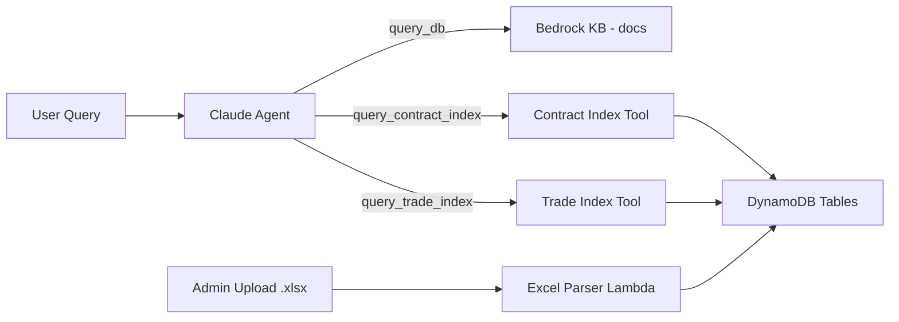
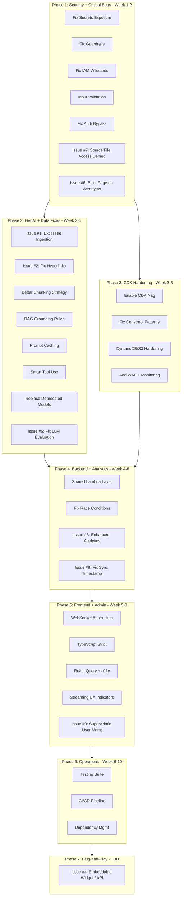

# ABE Chatbot -- Full Modernization Plan

This plan addresses **87 identified issues + 9 production launch requirements from OSD** across security, GenAI, infrastructure, backend, frontend, and operations. OSD stakeholder items are tagged with **[Issue #N]** throughout. Organized into 7 phases, ordered by severity and dependency.

---

## Phase 1: Critical Security Fixes (P0) -- DEPLOYED 2026-02-10

**Status: COMPLETE** -- Deployed to `ABEStackNonProd` on 2026-02-10. All 36 CloudFormation resources updated successfully (deployment time: 145s).

**What was done:**

- 1.1 Secrets: Guardrail ID + model ID externalized to env vars. Cognito secrets deferred to Phase 2 (TODO comment added in step-functions.ts).
- 1.2 Guardrails: Fixed -- moved from request body to top-level InvokeModelCommand params. Added try/catch around Bedrock response parsing.
- 1.3 IAM: All 12+ wildcard policies replaced with least-privilege actions across functions.ts, knowledge-base.ts, opensearch.ts, step-functions.ts.
- 1.4 S3 Validation: Added path traversal prevention + input validation to delete-s3 Lambda. Upload-s3 sanitization deferred to Phase 4.
- 1.5 Admin Auth: Fixed bare `except:` to `except Exception as e:` with explicit `admin = False` on failure in feedback-handler.
- 1.6 Frontend Prompt: Removed entire hardcoded system prompt from chat-input-panel.tsx. Prompt is now server-side only (prompt.mjs).
- 1.7 OpenSearch: **Deferred** to Phase 3 (requires VPC or principal-based policy; too risky for Phase 1).
- 1.8 [Issue #7]: Fixed -- deduplicate sources by S3 key before generating pre-signed URLs; frontend now uses pre-signed URLs directly.
- 1.9 [Issue #6]: Fixed -- sanitized all error messages sent to client; replaced alert() with inline notification.
- 1.10 Tool-use crash: Fixed all 3 bugs -- bitwise AND, undefined concat guard, JSON.parse try/catch with user-friendly fallback.

**Files modified:** `claude3Sonnet.mjs`, `index.mjs` (websocket-chat), `chat-message.tsx`, `chat-input-panel.tsx`, `functions.ts`, `step-functions.ts`, `knowledge-base.ts`, `opensearch.ts`, `delete-s3/lambda_function.py`, `feedback-handler/lambda_function.py`

### 1.1 Secrets Exposure

- **Cognito password in Lambda env vars** -- [step-functions.ts](lib/chatbot-api/functions/step-functions/step-functions.ts) lines 191-194 store `COGNITO_USERNAME` and `COGNITO_PASSWORD` as plaintext environment variables. Move to **AWS Secrets Manager** and retrieve at runtime via `secretsmanager:GetSecretValue`.
- **Hardcoded guardrail ID** (`ii43q6095rvh`) in [claude3Sonnet.mjs](lib/chatbot-api/functions/websocket-chat/models/claude3Sonnet.mjs) line 108. Move to environment variable.

### 1.2 Broken Bedrock Guardrails

- In [claude3Sonnet.mjs](lib/chatbot-api/functions/websocket-chat/models/claude3Sonnet.mjs) lines 107-110, the guardrail config is placed **inside the request body** instead of as top-level `InvokeModelCommand` parameters. Guardrails are **silently not applied**. Fix:

```javascript
new InvokeModelWithResponseStreamCommand({
  modelId: this.modelId,
  contentType: "application/json",
  accept: "application/json",
  body: JSON.stringify({ /* model params only */ }),
  guardrailIdentifier: process.env.GUARDRAIL_ID,
  guardrailVersion: "1",
});
```

### 1.3 Wildcard IAM Policies (12+ violations)

All in [functions.ts](lib/chatbot-api/functions/functions.ts), [knowledge-base.ts](lib/chatbot-api/knowledge-base/knowledge-base.ts), [opensearch.ts](lib/chatbot-api/opensearch/opensearch.ts), and [step-functions.ts](lib/chatbot-api/functions/step-functions/step-functions.ts):

- Replace `s3:*` with specific actions (`s3:GetObject`, `s3:PutObject`, `s3:ListBucket`, `s3:DeleteObject`) per function
- Replace `bedrock:*` with `bedrock:StartIngestionJob`, `bedrock:GetIngestionJob`
- Replace `aoss:*` with `aoss:APIAccessAll`
- Scope `bedrock:InvokeModel*` from `resources: ["*"]` to specific model ARNs

### 1.4 S3 Input Validation

- [delete-s3/lambda_function.py](lib/chatbot-api/functions/functions/delete-s3/lambda_function.py) line 24: `KEY` from user input passed directly to `s3.Object().delete()` with **no validation**. Add prefix allowlist.
- [upload-s3/index.mjs](lib/chatbot-api/functions/websocket-chat/upload-s3.mjs): No filename sanitization, no file type server-side validation, no size limits. Add all three.

### 1.5 Admin Auth Bypass

- [feedback-handler/lambda_function.py](lib/chatbot-api/functions/functions/feedback-handler/lambda_function.py) lines 23-39: Admin check wrapped in bare `except:` that silently continues. Replace with `except Exception as e:` and explicit deny on parse failure.

### 1.6 System Prompt Exposed in Frontend

- [chat-input-panel.tsx](lib/user-interface/app/src/components/chatbot/chat-input-panel.tsx) lines 215-274: The full LLM system prompt is embedded in client-side JavaScript. Any user can read it via DevTools. Remove entirely -- the prompt should only exist server-side.

### 1.7 OpenSearch Publicly Accessible

- [opensearch.ts](lib/chatbot-api/opensearch/opensearch.ts) line 44: `AllowFromPublic: true`. Restrict to VPC endpoints or specific AWS principals.

### 1.8 [Issue #7] Source File "Access Denied" When Clicked

**Bug**: Clicking source files in chatbot responses navigates to an AWS S3 page showing "Access Denied" XML error.

**Root Cause (two bugs)**:

1. **Frontend**: [chat-message.tsx](lib/user-interface/app/src/components/chatbot/chat-message.tsx) line 132 converts `s3://` URIs to `https://s3.amazonaws.com/` public URLs. The bucket is private, so these always 403.
2. **Backend**: [index.mjs](lib/chatbot-api/functions/websocket-chat/index.mjs) lines 81-112 generates pre-signed URLs but the deduplication logic (line 105) compares pre-signed URLs which are always unique, so dedup never works and the links array gets corrupted.

**Fix**:

- Backend: Deduplicate source documents by S3 key **before** generating pre-signed URLs
- Frontend: Use the pre-signed URLs from the backend response metadata directly instead of converting `s3://` URIs
- Pre-signed URLs already have a 1-hour expiry which is sufficient for the session
- No need to make the bucket public

### 1.9 [Issue #6] Error Page with Acronyms Prompt

**Bug**: When users prompt certain acronyms, an error page appears instead of a meaningful message.

**Root Cause**: The WebSocket error handler in [index.mjs](lib/chatbot-api/functions/websocket-chat/index.mjs) lines 421-429 sends raw error objects to the client (`<!ERROR!>: ${error}`), which can contain stack traces and internal details. The frontend in [chat-input-panel.tsx](lib/user-interface/app/src/components/chatbot/chat-input-panel.tsx) line 366 uses `alert()` for errors.

**Fix**:

- Backend: Catch Bedrock errors (likely model content filter or malformed input) and return user-friendly messages: "I'm sorry, I couldn't process that request. Please try rephrasing your question."
- Frontend: Replace `alert()` with an inline error message in the chat stream (render as a ChatBotMessageType.AI message with an error style)
- Add specific handling for Bedrock content filter responses (these are not errors -- they're valid responses that need graceful handling)

### 1.10 Tool-Use JSON Parsing Crash on Follow-Up Messages

**Bug**: When a user asks a follow-up question that triggers a KB search (e.g., "i want to buy carpet" then "from whom should i buy"), the chatbot crashes with:

> `<!ERROR!>: SyntaxError: Unexpected token '_', "_key": "carpet"}" is not valid JSON`

The response hangs with a loading spinner and the error banner appears at the top of the page.

**Root Cause**: Three compounding bugs in [index.mjs](lib/chatbot-api/functions/websocket-chat/index.mjs):

1. **Line 276 -- Bitwise AND instead of logical AND**: `assemblingInput & !skipChunk` uses `&` (bitwise) instead of `&&` (logical). While this accidentally works for simple booleans, it can cause edge-case failures in how `toolInput` is accumulated during streaming.
2. **Line 242 -- `JSON.parse(toolInput)` on incomplete/corrupted JSON**: Claude streams the tool input as `input_json_delta` chunks (partial JSON fragments via `parseChunk` line 29-31 of [claude3Sonnet.mjs](lib/chatbot-api/functions/websocket-chat/models/claude3Sonnet.mjs)). These are concatenated into `toolInput` string. But `parseChunk` returns `undefined` for unhandled chunk types (`content_block_stop`, `message_start`, `ping` -- lines 24-44). When `undefined` is concatenated to a string via `.concat()`, it becomes the literal text `"undefined"`, corrupting the JSON. The result: `toolInput` ends up as something like `{"query_undefinedkey": "carpet"}` or just a truncated fragment like `_key": "carpet"}"`.
3. **Line 303-307 -- Raw error leaks to client**: The catch block sends `<!ERROR!>: ${error}` directly to the WebSocket, exposing the internal `SyntaxError` and JSON fragment to the user.

**Fix (all in [index.mjs](lib/chatbot-api/functions/websocket-chat/index.mjs))**:

- **Line 276**: Change `assemblingInput & !skipChunk` to `assemblingInput && !skipChunk`
- **Line 277**: Add a null/undefined guard before concatenating:

```javascript
if (parsedChunk !== undefined && parsedChunk !== null) {
  toolInput = toolInput.concat(parsedChunk);
}
```

- **[claude3Sonnet.mjs](lib/chatbot-api/functions/websocket-chat/models/claude3Sonnet.mjs) `parseChunk**`: Return `null` explicitly for all unhandled chunk types instead of falling through to implicit `undefined`
- **Line 242**: Wrap `JSON.parse(toolInput)` in try/catch:

```javascript
let query;
try {
  query = JSON.parse(toolInput);
} catch (parseError) {
  console.error("Failed to parse tool input:", toolInput);
  // Send user-friendly error and continue
  await sendMessage(id, "I encountered an issue processing your request. Let me try again.");
  toolInput = "";
  usingTool = false;
  continue;
}
```

- **Line 307**: Replace raw error with sanitized message: `Data: "I'm sorry, something went wrong. Please try again or rephrase your question."`

---

## Phase 2: GenAI Pipeline Modernization

The current RAG pipeline has fundamental quality and cost issues.

### Phase 2 Partial Deployment -- 2026-02-11

**Deployed items (2.3, 2.4, 2.5 + date injection):**

- 2.3 [Issue #2] Hyperlinks: Strengthened prompt Section 5 with explicit markdown link instructions. Model now outputs `[text](url)` format for URLs from source documents.
- 2.4 RAG Grounding: Added Core Rules 8-10 (only answer from KB, cite sources, never fabricate) and new Section 11 (Grounding & Source Accuracy).
- 2.5 Forced Retrieval: Removed "Please use your search tool" prefix from user messages. Model now naturally decides when to use `query_db`.
- Date injection: System prompt now includes current Eastern Time date via `constructSysPrompt()`.

**Files modified:** `prompt.mjs`, `index.mjs` (websocket-chat)

**Verified in logs:** Greetings respond without KB search, date context works, out-of-scope questions correctly declined, hyperlinks rendered as markdown.

### Phase 2 Model Upgrades Deployment -- 2026-02-11

**Deployed items (2.10 model upgrades):**

- Title generation: Mistral 7B → Claude 3.5 Haiku (`FAST_MODEL_ID` env var). Much higher quality titles using Claude Messages API instead of legacy Mistral prompt format.
- Metadata summarization: Sonnet 4 (hardcoded) → Claude 3.5 Haiku (via `FAST_MODEL_ID` env var). Cheaper for document summarization tasks.
- All model IDs now env var-driven: `PRIMARY_MODEL_ID` (chat, eval) and `FAST_MODEL_ID` (titles, metadata). Upgrading to newer models is a one-line CDK change.
- Eval pipeline: removed hardcoded guardrail ID from `generate-response/models/claude3Sonnet.mjs`, removed forced retrieval prefix, upgraded Titan Embed v1 → v2.
- Deleted dead code: `llama13b.mjs` and `mistral7b.mjs` from both `websocket-chat/models/` and `generate-response/models/` (4 files, -386 lines).
- Removed `mistral.*` from chat Lambda IAM policy (no longer needed).
- Added `outputs: ['type=docker']` to eval DockerImageFunction to fix OCI manifest issue on ARM Mac deploys.

**Blocked:** Sonnet 4.5 and Haiku 4.5 require `aws-marketplace:Subscribe` which is denied by org SCP. Once the org admin allows marketplace subscriptions, upgrade by changing the env vars in `functions.ts` and `step-functions.ts`.

**Files modified:** `claude3Sonnet.mjs` (websocket-chat), `index.mjs` (websocket-chat), `lambda_function.py` (metadata-handler), `index.mjs` (generate-response), `claude3Sonnet.mjs` (generate-response), `lambda_function.py` (eval), `functions.ts`, `step-functions.ts`

**Files deleted:** `llama13b.mjs` (websocket-chat), `mistral7b.mjs` (websocket-chat), `llama13b.mjs` (generate-response), `mistral7b.mjs` (generate-response)

### Phase 2 Remaining Deployment -- 2026-02-12

**Deployed items (2.2, 2.6, 2.12):**

- 2.2 KB Chunking: Upgraded from FIXED_SIZE (300 tokens, 10% overlap) to SEMANTIC chunking (512 max tokens, 95th percentile breakpoint, buffer 1). Uses `addPropertyOverride` for CDK 2.140.0 compat. KB re-synced -- 100 docs indexed with 0 failures.
- 2.6 Prompt Caching: System prompt wrapped in `cache_control: {type: "ephemeral"}` array format for Bedrock prompt caching. Applied to websocket-chat and generate-response models (both streaming and non-streaming). 5-min TTL on Claude Sonnet 4.
- 2.12 Eval Pipeline Fix: Removed all mock fallbacks (MockSentenceTransformer, MockNumpy, cosine_similarity=0.5) that silently produced garbage metrics. Simplified aggregate Lambda to only aggregate pre-computed RAGAS scores (-600 lines). Removed broken live/retrieval eval paths, Cognito creds, WebSocket endpoint, ECR/Cognito IAM permissions from aggregate Lambda. Fixed generate-response: added parseChunk null guard, JSON.parse try/catch, synced stale prompt with grounding rules. Removed `perform_retrieval_evaluation: true` from step-functions.

**Files modified:** `knowledge-base.ts`, `claude3Sonnet.mjs` (websocket-chat), `claude3Sonnet.mjs` (generate-response), `index.mjs` (generate-response), `lambda_function.py` (aggregate-eval-results), `requirements.txt` (aggregate-eval-results), `step-functions.ts`

### Contract Index Implementation & Post-Deploy Fixes (2026-02-25)

**Status: COMPLETE** — Contract Index (SWC Index) built and deployed; status API, preview, and Python deps fixed after deploy.

**What was implemented (Contract Index):**

- **Backend:** DynamoDB table (`ContractIndexTable`: pk=INDEX, sk=META for meta, sk=0,1,… for rows). Parser Lambda (S3 trigger on `swc-index/*.xlsx`): Pydantic validation, writes rows + META (status PROCESSING at start, COMPLETE/ERROR on success/failure); preserves META when clearing rows. Query Lambda: status (GetItem META), preview (Query + filter out META in Python), query (Scan + filters). REST API: GET status/preview, POST upload-url (presigned); OPTIONS use CORS handler (no authorizer). Agent tool `query_contract_index` in chat model.
- **Frontend:** Data Dashboard → Contract Index tab: status (No data / Processing… / Ready — N rows / Error), single .xlsx upload, preview "Show first 10 rows"; status polling after upload.
- **Python deps for parser & query:** Both Lambdas use Pydantic (parser also openpyxl). CDK bundles deps via `pip install` in Docker. Stack uses `LAMBDA_DEFAULTS` with `architecture: ARM_64`, so Lambdas run on arm64. Bundling must produce arm64 wheels: `pip install --platform manylinux2014_aarch64 --implementation cp --python-version 3.12 --only-binary=:all: -r requirements.txt -t /asset-output` (and `cp -au . /asset-output`). Without `--platform manylinux2014_aarch64`, x86_64 wheels were bundled and Lambda failed with `No module named 'pydantic_core._pydantic_core'`.
- **Preview DynamoDB fix:** DynamoDB does not allow primary key attributes (`pk`, `sk`) in `FilterExpression`. Preview previously used `FilterExpression=Attr("sk").ne(SK_META)`, causing `ValidationException: Filter Expression can only contain non-primary key attributes`. Fix: Query with `KeyConditionExpression=Key("pk").eq(PK)` only, then filter out META in Python: `items = [it for it in items if it.get("sk") != SK_META]`.

**Files modified (recent):** `lib/chatbot-api/functions/functions.ts` (contract-index parser/query: bundling with pip --platform manylinux2014_aarch64, --only-binary=:all:), `lib/chatbot-api/functions/contract-index/query/lambda_function.py` (preview: remove FilterExpression on sk, filter META in Python). Earlier: parser (META PROCESSING/COMPLETE/ERROR, preserve META in _clear_table), query models (StatusResponse.status), frontend (status display, polling, contract-index-client status type).

**Pushed to main:** 9c5b209 — Fix contract-index: arm64 pydantic wheels and preview DynamoDB ValidationException.

**Trade Index:** Not yet implemented; Phase 2 [Issue #1] remains in progress for Trade Index.

### 2.1 [Issue #1] Statewide Contract Index & Trade Index Excel Files

**Bug**: ABE cannot read or produce results from these Excel files. The Excel files have macros and external APIs that we don't have access to yet.

**Vision**: Rather than dumping Excel content into the KB as flat text, build an **LLM agent with dedicated tools** that can query and leverage the structured Excel data at runtime. The Excel files serve as a reference guide the agent actively queries -- not passive text it retrieves from.

**Prerequisite**: Get the actual files from the OSD team and meet with the maintainer to understand the data structure, macros, and APIs (action item already raised by Anjith). The architecture below should be finalized after that conversation.

#### Recommended Approach: Agent with Structured Data Tools




1. **Parse Excel into DynamoDB**: A dedicated Lambda uses `openpyxl` to read the Excel files and load each sheet/table into purpose-built DynamoDB tables with proper indexes (GSIs on vendor name, contract category, commodity code, etc.)
2. **New agent tools**: Give Claude two new tools in [claude3Sonnet.mjs](lib/chatbot-api/functions/websocket-chat/models/claude3Sonnet.mjs):
  - `query_contract_index` -- accepts parameters like `vendor_name`, `contract_number`, `category`, `commodity_code`, `date_range` and queries DynamoDB
  - `query_trade_index` -- similar structured query tool for the Trade Index
3. **Tool Lambda**: A new Lambda handles these tool invocations, queries DynamoDB with the provided filters, and returns structured results
4. **Upload pipeline**: When admin uploads an `.xlsx` file, S3 trigger routes to the parser Lambda instead of the standard metadata handler. Parser extracts, validates, and loads into DynamoDB.
5. **Prompt update**: Add tool descriptions and usage instructions to [prompt.mjs](lib/chatbot-api/functions/websocket-chat/prompt.mjs) so Claude knows when to use Contract/Trade Index tools vs. the general KB

#### How This Could Fail (and mitigations)

- **Macro-dependent data**: If the macros compute derived values (e.g., pricing calculations, eligibility rules) that aren't stored in the raw cell data, we'd miss that logic. **Mitigation**: Meet with the Excel maintainer to document all macro logic; replicate critical calculations in the tool Lambda or as DynamoDB computed fields.
- **Complex cross-sheet references**: If Sheet A references Sheet B with formulas, `openpyxl` reads computed values only if the file was last saved with cached values. **Mitigation**: Use `openpyxl` with `data_only=True` to read cached computed values; if not available, use the `formulas` library or replicate logic.
- **External API dependencies**: If the macros call external APIs (e.g., a pricing service, a vendor database), we can't replicate those without API access. **Mitigation**: This is a blocker -- must be resolved in the scoping call. If APIs are involved, we need credentials and documentation.
- **Schema changes**: If the Excel structure changes (new columns, renamed sheets), the parser breaks silently. **Mitigation**: Add schema validation in the parser Lambda. If the uploaded file doesn't match the expected schema, reject with a clear error message to the admin.
- **Large data volume**: If the index has thousands of rows, DynamoDB queries need proper indexing. **Mitigation**: Design GSIs based on the actual query patterns users will have (determined after seeing the data).
- **Agent tool confusion**: Claude might choose the wrong tool or hallucinate query parameters. **Mitigation**: Write clear tool descriptions with examples; add parameter validation in the tool Lambda; test extensively with real user queries.

#### Alternative Approaches Considered

- **A. Agent + DynamoDB tools** (recommended above) -- Best for structured reference data. Precise queries, fast, scalable. Requires upfront schema design.
- **B. Dump into KB as text chunks** -- Simple but loses all structure. Poor retrieval for tabular data; can't filter/sort/aggregate. Bad fit for index/lookup data.
- **C. KB with foundation model parsing** -- Uses Claude to parse tables into text. Still stores as text chunks; can't handle macros; retrieval is fuzzy not precise. Okay for unstructured docs, bad for indexes.
- **D. Direct Excel file access at runtime** -- No data transformation needed, but slow (read entire file per query), can't index, Lambda cold start issues with large files. Not scalable.
- **E. Connect to the Excel's external API directly** -- Real-time data, no sync lag. But requires API access; single point of failure; adds latency. Only viable if API is stable and documented.

**Decision**: Go with Approach A (Agent + DynamoDB tools) as default. If the scoping call reveals the data is simple enough for text retrieval, Approach B+C could work as a quick win. If external APIs are involved, Approach E becomes a hybrid option.

### 2.2 Knowledge Base Chunking (High Impact on Answer Quality)

- [knowledge-base.ts](lib/chatbot-api/knowledge-base/knowledge-base.ts) lines 107-114: 300-token fixed chunks with 10% overlap are too small for procurement documents. Upgrade to:
  - **Semantic chunking** (already commented out at line 116) or **hierarchical chunking** (line 121)
  - If staying with fixed-size: increase to **600-800 tokens** with **20% overlap**
  - Enable **foundation model parsing** (commented out at line 128) for PDF tables and forms

### 2.3 [Issue #2] Non-Clickable Hyperlinks in Responses

**Bug**: Not all hyperlinks in chatbot responses are clickable.

**Root Cause (two issues)**:

1. **Prompt grounding conflict**: The system prompt in [prompt.mjs](lib/chatbot-api/functions/websocket-chat/prompt.mjs) instructs the model to avoid "making up" URLs. When the model is not 100% confident the URL is in the source data, it outputs the URL as plain text rather than a markdown link. This is a correct hallucination safeguard but overly conservative.
2. **Frontend rendering**: [chat-message.tsx](lib/user-interface/app/src/components/chatbot/chat-message.tsx) uses `react-markdown` with `remarkGfm`, which should auto-link URLs. However, bare URLs without markdown link syntax (`[text](url)`) may not be rendered as clickable depending on the markdown parser configuration.

**Fix**:

- **Prompt update**: Modify the system prompt to instruct: "When a URL is present in the retrieved source documents, include it as a clickable markdown link `[descriptive text](url)`. Only omit URLs if they are not found in the source data."
- **Frontend**: Add `remarkGfm` URL auto-linking plugin configuration to catch any bare URLs the model outputs. Ensure `rehype-raw` is enabled if HTML links appear in source data.
- **Verify data**: Confirm with the OSD team that the URLs they expect are actually present in the ingested documents (as Anjith noted).

### 2.4 RAG Grounding Instructions (Prevents Hallucination)

- [prompt.mjs](lib/chatbot-api/functions/websocket-chat/prompt.mjs): Add explicit grounding rules:
  - "Only answer based on the retrieved context"
  - "If the context doesn't contain the answer, say you don't have that information"
  - "Always cite your sources with document names"
  - Inject current date/time for recency verification

### 2.5 Fix Forced KB Retrieval on Every Message

- [index.mjs](lib/chatbot-api/functions/websocket-chat/index.mjs) line 161: Every user message is prepended with "Please use your search tool" -- even greetings. Add intent classification: skip retrieval for greetings, simple follow-ups, and clarifications. Let the model decide when to use tools naturally.

### 2.6 Enable Prompt Caching (50% Cost Reduction)

- Claude on Bedrock supports prompt caching. The system prompt is large (~4K tokens) and static per invocation. Add the `anthropic-beta: prompt-caching-2024-07-31` header and mark the system prompt with `cache_control: { type: "ephemeral" }`.

### 2.7 Conversation Memory Optimization

- [index.mjs](lib/chatbot-api/functions/websocket-chat/index.mjs) line 156: `slice(-2)` is arbitrary. Replace with **token-aware truncation** using a token counter (tiktoken or approximate). Target ~4K tokens of history, keeping the most recent messages plus a summary of earlier conversation.

### 2.8 Fix Pre-signed URL Deduplication Bug

- [index.mjs](lib/chatbot-api/functions/websocket-chat/index.mjs) lines 81-112: Source links are deduplicated *after* generating pre-signed URLs, but pre-signed URLs are always unique. Fix: deduplicate on the S3 key *before* generating pre-signed URLs.

### 2.9 Fix Broken `fetch_metadata` Tool

- [index.mjs](lib/chatbot-api/functions/websocket-chat/index.mjs) lines 217-234: The metadata tool handler is in the wrong scope and passes a `filterKey` parameter that `fetchMetadata()` doesn't accept. Restructure the tool-use loop to properly handle multi-turn tool calls.

### 2.10 Model Upgrades (Based on Account Inventory) -- COMPLETED (partial)

**Status:** Model infrastructure fully modernized. Env var-driven model IDs deployed. Dead code deleted. Sonnet 4.5/Haiku 4.5 upgrade blocked by org SCP -- currently using Sonnet 4 + Claude 3.5 Haiku.

Your AWS account has access to a rich set of models. Here is a complete upgrade strategy for every LLM usage in the codebase, mapped against what's actually available.

#### Available Models on Account (relevant subset)

**Anthropic Claude family:**

- `anthropic.claude-opus-4-6-v1` (Opus 4.6 -- most capable, highest cost)
- `anthropic.claude-opus-4-5-20251101-v1:0` (Opus 4.5)
- `anthropic.claude-opus-4-1-20250805-v1:0` (Opus 4.1)
- `anthropic.claude-sonnet-4-5-20250929-v1:0` (Sonnet 4.5 -- strong balance of quality/cost)
- `anthropic.claude-sonnet-4-20250514-v1:0` (Sonnet 4 -- currently used)
- `anthropic.claude-haiku-4-5-20251001-v1:0` (Haiku 4.5 -- fast, cheap, good for simple tasks)
- `anthropic.claude-3-5-haiku-20241022-v1:0` (Haiku 3.5 -- cheapest Claude)

**Cross-region inference profiles** (higher availability, auto-failover):

- `us.anthropic.claude-sonnet-4-5-20250929-v1:0` / `us.anthropic.claude-sonnet-4-20250514-v1:0`
- `us.anthropic.claude-haiku-4-5-20251001-v1:0`
- `us.anthropic.claude-opus-4-6-v1`

**Embedding models:**

- `amazon.titan-embed-text-v2:0` (currently used by KB -- 1024 dim)
- `cohere.embed-v4:0` (newer, potentially better quality)
- `cohere.embed-english-v3` / `cohere.embed-multilingual-v3`

**Reranking:**

- `cohere.rerank-v3-5:0` (available -- currently unused)

**Other:**

- `meta.llama4-scout-17b-instruct-v1:0` / `meta.llama4-maverick-17b-instruct-v1:0` (Llama 4)
- `mistral.mistral-large-3-675b-instruct` (Mistral Large 3)
- `us.amazon.nova-pro-v1:0` / `us.amazon.nova-lite-v1:0` (Amazon Nova)

#### Upgrade Plan by Use Case


| Use Case                     | Before                                                            | After (deployed)                                                         | Status |
| ---------------------------- | ----------------------------------------------------------------- | ------------------------------------------------------------------------ | ------ |
| **Primary chat**             | `us.anthropic.claude-sonnet-4-20250514-v1:0` (Sonnet 4)           | Sonnet 4 (via `PRIMARY_MODEL_ID` env var). Upgrade to Sonnet 4.5 blocked by SCP. | DONE |
| **Session title generation** | `mistral.mistral-7b-instruct-v0:2` (Mistral 7B -- **deprecated**) | `us.anthropic.claude-3-5-haiku-20241022-v1:0` (via `FAST_MODEL_ID`). Upgrade to Haiku 4.5 blocked by SCP. | DONE |
| **Metadata summarization**   | `us.anthropic.claude-sonnet-4-20250514-v1:0` (hardcoded Sonnet 4) | `us.anthropic.claude-3-5-haiku-20241022-v1:0` (via `FAST_MODEL_ID`). ~10x cheaper. Upgrade to Haiku 4.5 blocked by SCP. | DONE |
| **Eval response generation** | `us.anthropic.claude-sonnet-4-20250514-v1:0` (hardcoded)          | Sonnet 4 (via `PRIMARY_MODEL_ID` env var). Removed hardcoded guardrail ID, removed forced retrieval prefix. | DONE |
| **Eval metrics (RAGAS)**     | `amazon.titan-embed-text-v1` (**v1 -- mismatch!**)                | `amazon.titan-embed-text-v2:0`. Now matches KB embedding model. | DONE |
| **KB embeddings**            | `amazon.titan-embed-text-v2:0`                                    | **Keep** (or evaluate `cohere.embed-v4:0` later)                         | N/A |
| **Dead code**                | `llama13b.mjs` + `mistral7b.mjs` (4 files across websocket-chat and generate-response) | **Deleted** (-386 lines) | DONE |


#### Implementation Steps

1. **Make all model IDs configurable via environment variables** (set in CDK, not hardcoded in JS/Python):

```typescript
// In functions.ts CDK construct
environment: {
  PRIMARY_MODEL_ID: 'us.anthropic.claude-sonnet-4-5-20250929-v1:0',
  FAST_MODEL_ID: 'us.anthropic.claude-haiku-4-5-20251001-v1:0',
  EMBEDDING_MODEL_ID: 'amazon.titan-embed-text-v2:0',
}
```

1. **Refactor model classes** -- Instead of 3 separate model files (`claude3Sonnet.mjs`, `mistral7b.mjs`, `llama13b.mjs`), create a single `BedrockModel` class that accepts a model ID and handles the different API response formats:

```javascript
// models/bedrock-model.mjs
export class BedrockModel {
  constructor(modelId) {
    this.modelId = modelId || process.env.PRIMARY_MODEL_ID;
    this.client = new BedrockRuntimeClient({ region: process.env.AWS_REGION });
  }
  // Single parseChunk, getStreamedResponse, getResponse
  // with model-family detection based on modelId prefix
}
```

1. **Delete deprecated model files**:
  - Delete `mistral7b.mjs` (and duplicate in `generate-response/models/`)
  - Delete `llama13b.mjs` (and duplicate in `generate-response/models/`)
2. **Update metadata-handler** to use Haiku 4.5 via env var:

```python
model_id = os.environ.get('FAST_MODEL_ID', 'us.anthropic.claude-haiku-4-5-20251001-v1:0')
```

1. **Use cross-region inference profiles** (`us.` prefix) for all models to get automatic failover across us-east-1 and us-west-2.

#### Cost Impact Estimate


| Change                                         | Direction       | Estimated Impact                         |
| ---------------------------------------------- | --------------- | ---------------------------------------- |
| Sonnet 4 -> Sonnet 4.5 (primary chat)          | Neutral         | Same price, better quality               |
| Sonnet 4 -> Haiku 4.5 (metadata summarization) | Savings         | ~90% reduction on metadata ops           |
| Mistral 7B -> Haiku 4.5 (title generation)     | Slight increase | Minimal -- titles are very short         |
| Titan Embed v1 -> v2 (eval)                    | Neutral         | Already using v2 in KB                   |
| Adding Cohere Rerank (see 2.11)                | Cost            | ~$1/1000 queries, but improves retrieval |


**Net effect**: Likely **10-20% overall cost reduction** due to Haiku replacing Sonnet for metadata, while getting significantly better quality on the primary chat model.

### 2.11 Advanced RAG Features (Future)

- **Metadata filtering**: Configure KB to filter by document category (handbook, memo, guide) at query time
- **Reranking with Cohere Rerank 3.5**: Your account has `cohere.rerank-v3-5:0` available. Add a reranking step after KB retrieval to re-score results by relevance before passing to Claude. This typically improves answer quality by 10-20% for RAG systems. Implementation: call Rerank API between KB retrieve and Claude invoke in [index.mjs](lib/chatbot-api/functions/websocket-chat/index.mjs).
- **Multi-modal support**: Claude Sonnet 4.5 and Haiku 4.5 both support image input. Enable document image/chart understanding for procurement PDFs with diagrams.
- **Bedrock Agents**: Consider migrating from raw tool-use to Bedrock Agents for managed orchestration, guardrails, and action groups
- **Knowledge Base response generation**: Use KB's built-in `RetrieveAndGenerate` API instead of manual retrieve-then-prompt
- **Embedding model evaluation**: A/B test `cohere.embed-v4:0` vs `amazon.titan-embed-text-v2:0` for retrieval quality. Cohere v4 is newer and may improve relevance. Requires full KB re-index to switch.

### 2.12 [Issue #5] Fix LLM Evaluation Pipeline

**Bug**: LLM evaluation is broken/unreliable (issue reported by OSD).

**Root Causes (multiple)**:

- [eval/lambda_function.py](lib/chatbot-api/functions/step-functions/llm-evaluation/eval/lambda_function.py) line 295: Uses Titan Embed **v1** while the KB uses **v2** -- mismatched embedding spaces produce misleading scores. Align to v2.
- [aggregate-eval-results](lib/chatbot-api/functions/step-functions/llm-evaluation/aggregate-eval-results/lambda_function.py) lines 19-72: Mock fallback classes silently return garbage metrics (cosine similarity always 0.5, `MockSentenceTransformer` returns identical embeddings for all inputs). **Evaluation results are completely meaningless if these mocks activate.** Fix: fail loudly with clear error messages instead of returning fake metrics.
- Double Lambda invocation per test case wastes cost -- return context alongside the response in a single call.
- The WebSocket-based live evaluation in `aggregate-eval-results` (line 759) uses `threading.Thread` which is fragile in Lambda. Replace with direct Lambda invocation.

**Fix**:

- Align embedding model versions across KB and evaluation
- Remove mock fallbacks, fail explicitly on missing dependencies
- Ensure RAGAS dependencies are properly packaged in the Docker image
- Add validation that evaluation results are within expected ranges before saving to DynamoDB
- Add clear error reporting in the evaluation UI when a step fails

---

## Phase 3: CDK Infrastructure Hardening

### Phase 3 Partial Deployment -- 2026-02-18

**Deployed items (3.1, 3.2, 3.3, 3.4, 3.7, 3.9 partial):**

- 3.1 CDK Nag: Enabled `AwsSolutionsChecks({ verbose: true })` in `bin/gen-ai-mvp.ts`. Added comprehensive `NagSuppressions` in `gen-ai-mvp-stack.ts` for justified patterns (Lambda basic execution roles, S3 object wildcards, Bedrock model wildcards, CORS OPTIONS routes, Cognito MFA deferred, CDK-managed runtimes).
- 3.2 Construct fixes: Converted all 5 nested constructs from `extends cdk.Stack` to `extends Construct` (tables, buckets, opensearch, knowledge-base, functions). Resources stay scoped to `scope` to preserve CloudFormation logical IDs and prevent data loss. Replaced all `stackName` imports with dynamic `cdk.Stack.of(this).stackName`. Fixed `this.account` reference in opensearch.ts to `stack.account`.
- 3.3 DynamoDB: Added `pointInTimeRecovery: true` and `billingMode: PAY_PER_REQUEST` to all 4 tables. Removed provisioned throughput.
- 3.4 S3: Added `enforceSSL: true` to EvalResults, EvalTestCases, FeedbackDownload, and RagasDependencies buckets (KnowledgeSource already had it).
- 3.7 Lambda: Applied `LAMBDA_DEFAULTS` (ARM64 architecture, X-Ray Active tracing, 1-month log retention) to all ~20 Lambda functions across functions.ts and step-functions.ts. Added Step Functions StateMachine logging (LogGroup + LogLevel.ALL) and tracing.
- 3.9 Partial: Removed hardcoded CloudFront domain from CORS handler fallback and step-functions CHATBOT_API_URL. Fixed hardcoded `us-east-1` in Cognito OAuth domain to `cdk.Aws.REGION`. Added `env: { account: CDK_DEFAULT_ACCOUNT, region: CDK_DEFAULT_REGION }` to stack instantiation. Made BEDROCK_MODEL_ID env var-driven.
- Auth: Added Cognito password policy (min 12 chars, uppercase, lowercase, digits, symbols) to address AwsSolutions-COG1.

**Files modified:** `bin/gen-ai-mvp.ts`, `lib/gen-ai-mvp-stack.ts`, `lib/chatbot-api/tables/tables.ts`, `lib/chatbot-api/buckets/buckets.ts`, `lib/chatbot-api/opensearch/opensearch.ts`, `lib/chatbot-api/knowledge-base/knowledge-base.ts`, `lib/chatbot-api/functions/functions.ts`, `lib/chatbot-api/functions/step-functions/step-functions.ts`, `lib/chatbot-api/index.ts`, `lib/user-interface/index.ts`, `lib/authorization/index.ts`

**Verified:** `cdk synth` passed with zero cdk-nag errors. `cdk diff` confirmed no stateful resource replacements. Deployed successfully (145 resources, 540s). Chatbot functional at CloudFront URL.

**Remaining for Phase 3:** 3.8 Monitoring construct.

### Phase 3 API Gateway Hardening -- 2026-02-20

**Deployed items (3.5):**

- 3.5 API Gateway: Added CloudWatch access logging (JSON format, 1-month retention) to both HTTP API and WebSocket API stages via CfnStage escape hatches. Added throttling (burst: 50, rate: 100/sec) to both stages. Created account-level API Gateway CloudWatch Logs role (`CfnAccount`) with explicit dependency ordering to prevent race condition. Fixed open CORS handler that echoed back any `Origin` header -- replaced with static `*` and added `Access-Control-Max-Age` cache header.

**Files modified:** `lib/chatbot-api/gateway/rest-api.ts`, `lib/chatbot-api/gateway/websocket-api.ts`, `lib/chatbot-api/index.ts`, `lib/gen-ai-mvp-stack.ts`

**Verified:** `cdk synth` passed with zero cdk-nag errors. Deployed successfully (168s). Access logging and throttling confirmed in both API stages.

### Phase 3 WAF + CloudFront Modernization -- 2026-02-20

**Deployed items (3.6):**

- 3.6 CloudFront: Added WAFv2 WebACL with AWS Managed Rules (Common Rule Set, IP Reputation List, Known Bad Inputs) and rate limiting (1000 req/5min/IP). Migrated from legacy `CloudFrontWebDistribution` + manual OAI to modern `Distribution` API with `S3Origin` (auto-managed OAI). Changed price class from `PRICE_CLASS_ALL` to `PRICE_CLASS_100` (US/EU). Removed unnecessary S3 static website hosting config from website bucket (CloudFront handles SPA routing via `defaultRootObject` + `errorResponses`). Removed stale `AwsSolutions-CFR2` NagSuppression since WAF is now attached. OAC upgrade deferred to CDK version bump (current CDK 2.140.0 lacks `S3BucketOrigin`).

**Files modified:** `lib/user-interface/generate-app.ts`, `lib/user-interface/index.ts`

**Verified:** `cdk synth` passed with zero cdk-nag errors. `cdk diff` confirmed expected changes. Deployed successfully (573s). New CloudFront URL: `https://d39g9hl1ouzq6z.cloudfront.net`. Cognito callback URLs updated manually for SSO.

### Phase 3 Monitoring Construct -- 2026-02-20

**Deployed items (3.8):**

- 3.8 Monitoring: Created `MonitoringConstruct` with CloudWatch alarms, dashboard, and SNS alert topic. Alarms cover: Lambda errors + throttles (all 10 functions), chat Lambda high duration (>60s avg), DynamoDB read/write throttles (all 4 tables), HTTP API 5xx/4xx error rates, WebSocket zero-connections (outage detection), Step Functions eval pipeline failures. CloudWatch Dashboard (`ABEStackNonProd-Operations`) consolidates Lambda invocations/errors/duration, API Gateway requests/latency/errors, WebSocket connections, DynamoDB throttles, and eval pipeline stats. SNS alarm email configured via CDK context (`-c alarmEmail=...`) passed at deploy time through GitHub Actions secret `ALARM_EMAIL`.

**Files created:** `lib/chatbot-api/monitoring/monitoring.ts`

**Files modified:** `lib/chatbot-api/index.ts`, `lib/gen-ai-mvp-stack.ts`, `.github/workflows/deploy.yml`

---

## Phase 4: Backend Lambda Improvements

### Phase 4 Analytics Deployment -- 2026-02-21

**Deployed items (4.3 -- Issue #3):**

- 4.3 Enhanced Analytics: New `AnalyticsTable` DynamoDB table (PK: `topic`, SK: `timestamp`, GSI `DateIndex` on `date_key`+`topic`). New `FAQClassifierFunction` Lambda that asynchronously classifies every user chat message using Claude Haiku into 10 procurement categories (General Procurement, Contract Search, Vendor Information, Bidding & Solicitation, Pricing & Cost, Compliance & Regulations, Forms & Documentation, IT Procurement, Greeting/Small Talk, Other). Greetings are filtered out; low-confidence (<0.6) questions bucketed as "Other". Classification is fire-and-forget (zero latency impact on chat). Enhanced `metrics-handler` with three query modes: `overview` (KPIs + daily breakdown + avg msgs/session + peak hour), `faq` (top topics + sample questions from AnalyticsTable), `traffic` (hourly distribution + enhanced stats). Frontend metrics page rebuilt with MUI components (Tabs, Cards, LineChart, BarChart, expandable FAQ table) inside existing `BaseAppLayout` shell for navigation continuity. New Cursor rule (`.cursor/rules/no-cloudscape.mdc`) bans Cloudscape in new code; MUI mandated for new features.

**Files created:** `lib/chatbot-api/functions/faq-classifier/lambda_function.py`, `.cursor/rules/no-cloudscape.mdc`

**Files modified:** `lib/chatbot-api/tables/tables.ts`, `lib/chatbot-api/functions/functions.ts`, `lib/chatbot-api/index.ts`, `lib/chatbot-api/functions/websocket-chat/index.mjs`, `lib/chatbot-api/functions/metrics-handler/lambda_function.py`, `lib/user-interface/app/src/pages/admin/metrics-page.tsx`, `lib/user-interface/app/src/common/api-client/metrics-client.ts`, `lib/user-interface/app/package.json`

**New frontend dependencies:** `@mui/material@^6.4.8`, `@mui/x-charts@^7`

**Verified:** `cdk synth` passed, `cdk diff` confirmed expected changes, TypeScript clean, Vite build clean, Python syntax clean. Deployed successfully (19 resources created/updated).

### 3.1 Enable CDK Nag

- [bin/gen-ai-mvp.ts](bin/gen-ai-mvp.ts): Add `Aspects.of(app).add(new AwsSolutionsChecks({ verbose: true }))`. The `cdk-nag` dependency is already installed but **never activated**. All existing `NagSuppressions` in the codebase are dead code.

### 3.2 Fix CDK Anti-Patterns

- **Nested Stacks**: [tables.ts](lib/chatbot-api/tables/tables.ts), [buckets.ts](lib/chatbot-api/buckets/buckets.ts), [opensearch.ts](lib/chatbot-api/opensearch/opensearch.ts), [knowledge-base.ts](lib/chatbot-api/knowledge-base/knowledge-base.ts), [functions.ts](lib/chatbot-api/functions/functions.ts) all extend `cdk.Stack` but are used inside a `Construct`. Change to `extends Construct`.
- **Resources on `scope**`: Same files create resources with `scope` (parent) instead of `this` (self). Fix to use `this` so the construct tree is correct.

### 3.3 DynamoDB Hardening

All in [tables.ts](lib/chatbot-api/tables/tables.ts):

- Add `pointInTimeRecovery: true` (backup/recovery)
- Add `billingMode: dynamodb.BillingMode.PAY_PER_REQUEST` (cost optimization for unpredictable traffic)
- Add `encryption: dynamodb.TableEncryption.AWS_MANAGED` at minimum
- Set explicit `removalPolicy`

### 3.4 S3 Bucket Hardening

In [buckets.ts](lib/chatbot-api/buckets/buckets.ts):

- Add `blockPublicAccess: s3.BlockPublicAccess.BLOCK_ALL` to `evalResultsBucket`, `evalTestCasesBucket`, `ragasDependenciesBucket` (missing on 3 of 5 buckets)
- Add `enforceSSL: true` to all 5 buckets (missing on all)
- Restrict CORS `allowedOrigins` from `['*']` to the CloudFront domain
- Add `serverAccessLogsBucket` to all buckets
- Add lifecycle rules for old evaluation results

### 3.5 API Gateway Hardening

- [rest-api.ts](lib/chatbot-api/gateway/rest-api.ts): Add access logging, throttling (default stage), restrict CORS origins
- [websocket-api.ts](lib/chatbot-api/gateway/websocket-api.ts): Add access logging, connection throttling
- Fix open CORS in [index.ts](lib/chatbot-api/index.ts) line 42 -- the inline Lambda echoes back any origin

### 3.6 CloudFront Modernization

In [generate-app.ts](lib/user-interface/generate-app.ts):

- Add **AWS WAF** web ACL (bot control, rate limiting, IP reputation)
- Migrate from legacy `CloudFrontWebDistribution` + `OriginAccessIdentity` to modern `Distribution` + `OriginAccessControl`
- Change `PRICE_CLASS_ALL` to `PRICE_CLASS_100` (US-focused users)

### 3.7 Lambda Best Practices

Apply to all ~20 Lambda functions in [functions.ts](lib/chatbot-api/functions/functions.ts) and [step-functions.ts](lib/chatbot-api/functions/step-functions/step-functions.ts):

- `architecture: lambda.Architecture.ARM_64` (~20% cost savings)
- `tracing: lambda.Tracing.ACTIVE` (X-Ray distributed tracing)
- `logRetention: logs.RetentionDays.ONE_MONTH` (prevent unbounded log costs)
- Increase memory for Bedrock-invoking functions (256-512MB minimum)
- Add reserved concurrency limits

### 3.8 Monitoring & Observability (New Construct)

Create a new `MonitoringStack` construct:

- CloudWatch Alarms: Lambda errors, API Gateway 5xx, DynamoDB throttles, Step Functions failures
- CloudWatch Dashboard consolidating all metrics
- SNS topic for alerts
- Custom metrics for chat response latency, KB retrieval quality

### 3.9 Multi-Environment Support

- Parameterize [constants.ts](lib/constants.ts) to accept environment context (`dev`/`staging`/`prod`) via CDK context
- Set `env` property in [bin/gen-ai-mvp.ts](bin/gen-ai-mvp.ts)
- Remove all hardcoded CloudFront domains (e.g., `dcf43zj2k8alr.cloudfront.net`)

---

## Phase 4: Backend Lambda Improvements

### 4.1 Shared Utilities Layer

Create a Lambda Layer with:

- **Structured JSON logger** (replace all `print()` calls -- affects 15+ Lambdas)
- **Standard response builder** (consistent error/success response schema)
- **CORS handler** (single source of truth for allowed origins)
- **Input validator** (schema validation for all endpoints)
- **Admin auth checker** (deduplicate the 6+ copies of admin role check)

### 4.2 Fix Session Handler Race Condition

- [session-handler/lambda_function.py](lib/chatbot-api/functions/functions/session-handler/lambda_function.py): `update_session` does read-then-write. Replace with atomic DynamoDB `list_append`:

```python
table.update_item(
    Key={'user_id': user_id, 'session_id': session_id},
    UpdateExpression="SET chat_history = list_append(if_not_exists(chat_history, :empty), :new_entry)",
    ExpressionAttributeValues={':new_entry': [new_chat_entry], ':empty': []}
)
```

### 4.3 [Issue #3] Enhanced Analytics (FAQ Tracking + Traffic Stats)

**Feature request**: Analytics not available for: frequently asked questions, user logs, high/low traffic stats, agency information.

**Current state**: [metrics-handler/lambda_function.py](lib/chatbot-api/functions/functions/metrics-handler/lambda_function.py) only tracks basic counts (unique users, total sessions, total messages, daily breakdown). It also does two full table scans per request which is expensive and slow.

**Phase 1 -- FAQ Tracking + Enhanced Traffic (this sprint)**:

- **FAQ Tracking**:
  - Add a new DynamoDB table `FAQTrackingTable` (partition key: `category`, sort key: `question_hash`)
  - In the WebSocket chat handler, after each user message, classify the question topic using a lightweight Claude Haiku call (or keyword extraction) and write to the FAQ table with a counter
  - Categories: start with the existing feedback topics (General, Procurement) plus auto-detected sub-topics
  - New API endpoint: `GET /analytics/faq` returns top N questions by frequency, filterable by date range and category
  - Frontend: Add an "FAQ Insights" tab to the metrics dashboard showing top questions, trending topics, and category distribution
- **Enhanced Traffic Stats**:
  - Replace the full table scans with a **DynamoDB GSI on `time_stamp**` for efficient date-range queries
  - Add hourly/daily aggregation via DynamoDB Streams + aggregator Lambda writing to a `MetricsAggregateTable`
  - Track: peak hours, average session duration, messages per session, response times
  - Frontend: Add time-series charts (daily/weekly/monthly views) using a charting library
- **User Activity Logs**:
  - Add a `UserActivityTable` tracking login events, session starts, and key actions
  - New API endpoint: `GET /analytics/user-logs` (admin only) with pagination and filtering
  - Frontend: Searchable user activity log in admin panel

**Phase 2 -- Agency Information (pending OSD clarification)**:

- Need to understand what "Agency Information" means in context (user's agency? which agencies use ABE?)
- If agency is a user attribute: add `agency` as a custom Cognito attribute, track per-session
- If agency-level analytics: group metrics by agency for comparative dashboards

### 4.4 [Issue #8] Fix Document Sync Timestamp in Data Dashboard

**Bug**: Timestamp of document sync is incorrect in the Data dashboard.

**Root Cause**: The [kb-sync/lambda_function.py](lib/chatbot-api/functions/functions/kb-sync/lambda_function.py) `get_last_sync` function sorts ingestion jobs in memory and returns the timestamp. The issue is likely:

1. Timezone mismatch -- Bedrock returns UTC timestamps but the frontend displays them raw without converting to **Eastern Time (EST/EDT)**, which is the OSD team's timezone
2. Or the `startedAt` field is used instead of `completedAt` for the "last synced" display

**Fix**:

- Backend: Return both `startedAt` and `completedAt` timestamps in ISO 8601 with explicit UTC timezone marker (`Z` suffix)
- Frontend: Convert UTC to **America/New_York** (handles EST/EDT automatically) on display:

```typescript
new Intl.DateTimeFormat('en-US', {
  timeZone: 'America/New_York',
  dateStyle: 'medium',
  timeStyle: 'short',
}).format(new Date(utcTimestamp))
// e.g., "Feb 6, 2026, 2:17 PM"
```

- Add the sync status (COMPLETE/IN_PROGRESS/FAILED) alongside the timestamp
- Apply the same EST conversion to all other timestamps in the admin dashboard (feedback, evaluations, sessions) for consistency

### 4.4 Eliminate Code Duplication

Shared code duplicated across 2-3 files:

- `retrieveKBDocs` -- in `websocket-chat/index.mjs` and `generate-response/index.mjs`
- `fetchMetadata` / `constructSysPrompt` -- in 2 places
- System prompt -- in `prompt.mjs` and hardcoded again in `generate-response/index.mjs`
- `DecimalEncoder` / `convert_from_decimal` -- in 3 Python Lambdas
Extract into shared modules or Lambda Layers.

### 4.5 Remove Hardcoded Values

Replace all hardcoded `us-east-1` with `process.env.AWS_REGION` (auto-set by Lambda) -- affects 7+ files. Centralize model IDs, confidence thresholds, and pagination limits as environment variables set in CDK.

### 4.6 CSV Injection Fix

- [feedback-handler](lib/chatbot-api/functions/functions/feedback-handler/lambda_function.py) `clean_csv`: Add Excel formula injection protection by escaping values starting with `=`, `+`, `-`, `@`.

### 4.7 Error Response Standardization

Define a consistent error response schema across all Lambdas:

```json
{
  "statusCode": 400,
  "headers": { "Content-Type": "application/json", "Access-Control-Allow-Origin": "<cloudfront-domain>" },
  "body": "{\"error\": {\"code\": \"INVALID_INPUT\", \"message\": \"User-friendly message\"}}"
}
```

Replace all bare `except:` with `except Exception as e:` (6+ occurrences). Never leak stack traces to clients.

### 4.8 Structured LLM Output Validation (Pydantic + JSON Best Practices)

**Problem**: The codebase has **13 LLM-to-JSON parsing points** across Python and JavaScript, almost none with proper validation. LLM outputs are inherently unpredictable -- even with tool schemas, models can produce malformed JSON, missing fields, or unexpected types. The current code does raw `JSON.parse` / `json.loads` with no schema validation, causing silent data corruption or unhandled crashes.

**Audit of current state** (13 parsing points):

- **0 of 13** use any schema validation library
- **5 of 13** have no error handling at all around the JSON parse
- **2 of 13** (the tool_use input parsing in `index.mjs` line 242 and `generate-response/index.mjs` line 388) are **critical** -- they parse LLM-generated JSON with zero validation
- **1 of 13** (metadata-handler) has decent validation but contains a redundant parse bug on line 141

#### 4.8.1 Python Lambdas: Add Pydantic Models

For all Python Lambdas that parse LLM output, define Pydantic models for validation:

**metadata-handler** -- [lambda_function.py](lib/chatbot-api/functions/functions/metadata-handler/lambda_function.py):

```python
from pydantic import BaseModel, Field, field_validator
from typing import Literal
from enum import Enum

class DocumentCategory(str, Enum):
    USER_GUIDE = "user guide"
    HANDBOOK = "handbook"
    SWC_INDEX = "swc index"
    EXTERNAL_REFERENCE = "external reference"
    MEMOS = "memos"
    UNKNOWN = "unknown"

class DocumentTags(BaseModel):
    category: DocumentCategory = DocumentCategory.UNKNOWN
    complexity: Literal["low", "medium", "high"] = "medium"
    author: str = "unknown"
    creation_date: str = "unknown"

    @field_validator("creation_date")
    @classmethod
    def validate_date(cls, v):
        if v == "unknown":
            return v
        # Validate YYYY-MM-DD format
        from datetime import datetime
        try:
            datetime.strptime(v, "%Y-%m-%d")
        except ValueError:
            return "unknown"
        return v

class MetadataSummary(BaseModel):
    summary: str = "No summary available"
    tags: DocumentTags = Field(default_factory=DocumentTags)
```

Then replace raw `json.loads()` + manual validation (lines 133-167) with:

```python
try:
    text_content = result['content'][0]['text']
    parsed = MetadataSummary.model_validate_json(text_content)
except (ValidationError, KeyError, IndexError) as e:
    logger.warning(f"LLM output validation failed: {e}")
    parsed = MetadataSummary()  # safe defaults
```

This replaces ~35 lines of manual tag validation with a single Pydantic model call. The `model_validate_json` method handles both JSON parsing and schema validation in one step.

**eval pipeline** -- For any future Python LLM calls (e.g., FAQ classification in the analytics feature), always define Pydantic models first:

```python
class FAQClassification(BaseModel):
    category: str
    sub_topic: str
    confidence: float = Field(ge=0.0, le=1.0)
```

**Add `pydantic` to all Python Lambda requirements.txt files** (it's lightweight and has no native dependencies, so it works in standard Lambda runtimes).

#### 4.8.2 JavaScript Lambdas: Add Zod Schemas

For the Node.js Lambdas (websocket-chat, generate-response), use **Zod** for runtime schema validation:

**Tool-use input validation** -- [index.mjs](lib/chatbot-api/functions/websocket-chat/index.mjs) line 242:

```javascript
import { z } from 'zod';

const QueryDbInput = z.object({
  query: z.string().min(1).max(2000),
});

const FetchMetadataInput = z.object({
  filter_key: z.string().min(1),
});

// Replace: let query = JSON.parse(toolInput);
// With:
let query;
try {
  const raw = JSON.parse(toolInput);
  query = QueryDbInput.parse(raw);
} catch (parseError) {
  console.error("Tool input validation failed:", toolInput, parseError);
  // Graceful fallback: use the raw user message as the query
  query = { query: userMessage };
}
```

**Bedrock API response validation** -- [claude3Sonnet.mjs](lib/chatbot-api/functions/websocket-chat/models/claude3Sonnet.mjs) line 121:

```javascript
const BedrockResponse = z.object({
  content: z.array(z.object({
    text: z.string().optional(),
    type: z.string(),
  })).min(1),
});

// Replace: JSON.parse(new TextDecoder().decode(apiResponse.body)).content[0].text
// With:
const raw = JSON.parse(new TextDecoder().decode(apiResponse.body));
const validated = BedrockResponse.parse(raw);
return validated.content[0].text ?? "";
```

**Add `zod` to the websocket-chat and generate-response `package.json**` (zero dependencies, ~50KB).

Apply the same pattern to the duplicate code in `generate-response/index.mjs` lines 359 and 388.

#### 4.8.3 Claude Tool Definitions: Tighten Input Schemas

The current tool definitions in [claude3Sonnet.mjs](lib/chatbot-api/functions/websocket-chat/models/claude3Sonnet.mjs) lines 54-86 have minimal schemas. Tighten them to constrain LLM output:

```javascript
tools: [
  {
    name: "query_db",
    description: "Query the knowledge base for procurement information. Use a clear, specific search query.",
    input_schema: {
      type: "object",
      properties: {
        query: {
          type: "string",
          description: "A specific search query to find relevant procurement documents. Be concise and focused.",
          minLength: 3,
          maxLength: 500,
        }
      },
      required: ["query"],
      additionalProperties: false,  // prevent extra fields
    }
  },
  // ... same for fetch_metadata
]
```

Adding `additionalProperties: false` tells Claude the exact shape expected, reducing malformed output. Adding `minLength`/`maxLength` prevents empty or absurdly long queries.

#### 4.8.4 General JSON Output Best Practices

Apply these rules across the entire codebase:

- **Never parse LLM output without a try/catch/except** -- LLMs are inherently non-deterministic
- **Always validate parsed JSON against a schema** (Pydantic for Python, Zod for JS) before accessing fields
- **Always define safe defaults** -- if validation fails, return a sensible fallback instead of crashing
- **Log validation failures** with the raw LLM output for debugging (but never send raw output to the client)
- **Use `model_validate_json()` in Pydantic** (not `json.loads()` then `Model(**data)`) -- it's faster and handles both parsing + validation in one step
- **For the metadata-handler**: Remove the redundant `json.loads()` on line 141 that re-parses after the try/catch on line 133
- **For streaming tool_use**: Always check `toolInput` is non-empty and starts with `{` before attempting `JSON.parse`

#### 4.8.5 Files Affected


| File                                         | Language | What to add                                        | Schema                                              |
| -------------------------------------------- | -------- | -------------------------------------------------- | --------------------------------------------------- |
| `metadata-handler/lambda_function.py`        | Python   | Pydantic `MetadataSummary` model                   | `{summary, tags:{category,complexity,author,date}}` |
| `metadata-handler/config.py`                 | Python   | Move schema definition here alongside prompt       | --                                                  |
| `websocket-chat/index.mjs`                   | JS       | Zod `QueryDbInput`, `FetchMetadataInput` schemas   | `{query: string}`, `{filter_key: string}`           |
| `websocket-chat/models/claude3Sonnet.mjs`    | JS       | Zod `BedrockResponse` schema; tighten tool schemas | `{content:[{text,type}]}`                           |
| `websocket-chat/models/mistral7b.mjs`        | JS       | Zod schema + try/catch                             | `{outputs:[{text}]}`                                |
| `generate-response/index.mjs`                | JS       | Same Zod schemas (or shared via Lambda Layer)      | Same as websocket-chat                              |
| `generate-response/models/claude3Sonnet.mjs` | JS       | Same (deduplicate with websocket-chat)             | Same                                                |
| `generate-response/models/mistral7b.mjs`     | JS       | Same (deduplicate)                                 | Same                                                |
| All Python Lambdas                           | Python   | Add `pydantic` to requirements.txt                 | --                                                  |
| `websocket-chat/package.json`                | JS       | Add `zod` dependency                               | --                                                  |
| `generate-response/package.json`             | JS       | Add `zod` dependency                               | --                                                  |


---

## Phase 5: Frontend Modernization

### 5.1 WebSocket Abstraction (Highest Impact)

- Replace the raw WebSocket per-message pattern in [chat-input-panel.tsx](lib/user-interface/app/src/components/chatbot/chat-input-panel.tsx) with a proper `useWebSocket` hook (the `react-use-websocket` dependency is already installed but unused)
- Add reconnection logic, connection state management, and exponential backoff
- Move JWT from URL query string to first-message authentication pattern

### 5.2 TypeScript Strict Mode

- Enable `strict: true` in [tsconfig.json](lib/user-interface/app/tsconfig.json) and fix all resulting type errors
- Remove all `as any` casts and replace with proper interfaces
- Fix `useState<boolean>(null)` and similar type violations

### 5.3 Error Boundaries & Loading States

- Add React Error Boundaries around: top-level app, chat area, admin pages
- Fix admin page flash: change `useState<boolean>(false)` to `useState<boolean | null>(null)` with a loading spinner for the `null` state
- Add proper loading/error/empty states to all data-fetching components

### 5.4 Route-Level Code Splitting

- Add `React.lazy()` + `Suspense` for all route components in [app.tsx](lib/user-interface/app/src/app.tsx):

```typescript
const LlmEvaluationPage = React.lazy(() => import('./pages/admin/llm-evaluation-page'));
```

This prevents admin-only code from loading for regular users.

### 5.5 Data Fetching Layer

- Add **React Query** (TanStack Query) for:
  - Automatic caching and revalidation
  - Loading/error state management
  - Request deduplication
  - Optimistic updates
- Remove manual retry logic in [sessions-client.ts](lib/user-interface/app/src/common/api-client/sessions-client.ts)
- Add `AbortController` to all fetch calls for cleanup on unmount

### 5.6 Accessibility (a11y) Fixes

- Replace all `<div onClick>` with `<button>` in landing pages ([landing-page.tsx](lib/user-interface/app/src/pages/landing-page.tsx))
- Add `aria-label` to chat textarea, source dropdowns, feedback buttons
- Add skip-to-content navigation link in `GlobalHeader`
- Fix color contrast on landing page gradient backgrounds
- Remove the MutationObserver ARIA hack in [llm-evaluation-page.tsx](lib/user-interface/app/src/pages/admin/llm-evaluation-page.tsx)

### 5.7 Dependency Cleanup

- **Upgrade** `aws-amplify` from v5 to v6 (v5 is legacy, different API surface)
- **Remove unused**: `react-use-websocket` (or actually use it per 5.1), `@emotion/*` (if committing to styled-components), FontAwesome icons (Cloudscape + MUI already used), `regenerator-runtime`
- **Consolidate styling**: Pick Cloudscape + SCSS modules, migrate off styled-components and emotion (eliminates 2 CSS-in-JS runtimes from the bundle)

### 5.8 Production Hardening

- Remove all `console.log` calls (dozens found) or replace with a logger that's disabled in production
- Remove `alert()` calls (found in [knowledge-management-client.ts](lib/user-interface/app/src/common/api-client/knowledge-management-client.ts))
- Add a proper 404 page instead of the catch-all redirect that creates empty sessions
- Fix the `ChatScrollState` mutable static class -- convert to a React ref or context

### 5.9 Help & Guide / Tips & Questions Consolidation — COMPLETED 2026-02-20

**Done**: Merged the duplicate "Help & Guide" (navbar) and "Tips & Questions" (sidebar) into a single **Help & Guide** experience in the top navbar.

- **Unified page**: Single tabbed page at `/help` with tabs: **Tips & Questions** (prompting tips + sample questions), **About ABE**, **Support**.
- **Navbar**: Help icon now navigates to `/help`.
- **Sidebar**: "Tips & Questions" link removed; all help content is reachable via the navbar.
- **Redirects**: `/chatbot/tips` and `/faq-and-guide/*` redirect to `/help`.

**Files**: `pages/help/how-to-use.tsx` (rewritten as tabbed Help page), `app.tsx` (routes), `navigation-panel.tsx` (sidebar link removed), `global-header.tsx` (Help → `/help`). Old pages `about-chatbot.tsx`, `support.tsx`, `tips-and-questions.tsx` are no longer routed but kept for reference.

### 5.10 Mobile Responsiveness

- Landing pages use fixed pixel sizes (90px font, 90px padding) with no media queries. Add responsive design using `clamp()`, viewport units, or media queries.
- Test all chat and admin interfaces on mobile viewports

### 5.11 S3 URL Security

- [chat-message.tsx](lib/user-interface/app/src/components/chatbot/chat-message.tsx) line 132: Converts `s3://` URIs to `https://s3.amazonaws.com/` public URLs on the client. This assumes public bucket access. All document links should use server-generated pre-signed URLs. (Overlaps with Issue #7 fix in Phase 1.)

### 5.12 [Issue #9] SuperAdmin Add/Edit User Page

**Status**: Cannot be implemented due to SSO integration — needs clarity from OSD side.

**Feature request**: Admin page to manage Cognito users (create accounts, assign roles, enable/disable users).

**Implementation**:

- **Backend -- New Lambda `user-management-handler**`:
  - `POST /admin/users` -- Create a new Cognito user (`adminCreateUser`) with specified email and role
  - `GET /admin/users` -- List all users in the User Pool (`listUsers`) with pagination
  - `PUT /admin/users/:userId` -- Update user attributes (role, enabled status) via `adminUpdateUserAttributes`
  - `DELETE /admin/users/:userId` -- Disable a user via `adminDisableUser` (soft delete, not permanent)
  - `POST /admin/users/:userId/reset-password` -- Force password reset via `adminResetUserPassword`
  - All endpoints require `Master Admin` or `Super Admin` role in `custom:role`
  - IAM: Lambda needs `cognito-idp:AdminCreateUser`, `cognito-idp:ListUsers`, `cognito-idp:AdminUpdateUserAttributes`, `cognito-idp:AdminDisableUser`, `cognito-idp:AdminResetUserPassword` on the User Pool ARN
- **Frontend -- New admin page `/admin/users**`:
  - User table with columns: Email, Role, Status (Enabled/Disabled), Created Date, Last Login
  - "Add User" button opens a modal with email input and role dropdown
  - Edit role via inline dropdown or edit modal
  - Disable/Enable toggle per user
  - Reset password button
  - Add route to [app.tsx](lib/user-interface/app/src/app.tsx) and navigation link in admin section of [navigation-panel.tsx](lib/user-interface/app/src/components/navigation-panel.tsx)
- **CDK -- New REST API routes**:
  - Add `/admin/users` routes to [rest-api.ts](lib/chatbot-api/gateway/rest-api.ts) with JWT authorizer
  - Add the Lambda function to [functions.ts](lib/chatbot-api/functions/functions.ts)

### 5.13 Streaming UX Indicators (Tool-Use Pause Fix)

**Bug**: When the chatbot response involves a tool call (KB retrieval), the AI appears to finish its answer, then suddenly continues seconds later with no visual indicator that it was still working.

**Root Cause**: The streaming flow has a multi-second gap during tool execution that the UI does not communicate:

1. Claude streams preamble text ("Let me search for that...") -- text appears in the chat bubble
2. Claude decides to use `query_db` -- streaming **stops completely** while tool input JSON is assembled and `retrieveKBDocs` executes (2-5 seconds)
3. After KB results return, a new stream starts and Claude generates the actual answer -- text **suddenly resumes**

The user perceives step 1's text as the complete answer because:
- The `<Spinner />` in [chat-message.tsx](lib/user-interface/app/src/components/chatbot/chat-message.tsx) line 149 only shows when `content.length === 0` -- it disappears the instant the first text chunk arrives
- There is no blinking cursor, typing dots, or "searching..." indicator during the tool-use pause
- The only remaining signal is the subtle "Loading" text on the Send button, which most users won't notice
- Then step 3's text appearing feels like the AI "randomly continued" or restarted

**Fix -- Backend ([index.mjs](lib/chatbot-api/functions/websocket-chat/index.mjs)):**

Send lightweight status markers over the WebSocket so the frontend knows what's happening (same pattern as the existing `!<|EOF_STREAM|>!` marker):

- Send `!<|TOOL_SEARCHING|>!` right before KB retrieval starts (~line 274, after tool input is parsed, before `retrieveKBDocs` call)
- Send `!<|TOOL_COMPLETE|>!` right after KB results return (~line 316, before the loop continues with the new stream)

**Fix -- Frontend ([chat-input-panel.tsx](lib/user-interface/app/src/components/chatbot/chat-input-panel.tsx)):**

- Add a `streamingStatus` state: `'idle' | 'streaming' | 'searching'`
- Set `streaming` when text chunks arrive
- Set `searching` when `!<|TOOL_SEARCHING|>!` is received
- Set back to `streaming` when `!<|TOOL_COMPLETE|>!` is received
- Set `idle` on WebSocket close / EOF
- Pass `streamingStatus` to the message component

**Fix -- Frontend ([chat-message.tsx](lib/user-interface/app/src/components/chatbot/chat-message.tsx)):**

- When `streamingStatus === 'streaming'` and this is the last AI message: show a **blinking cursor** (`|`) after the text, indicating more text is coming
- When `streamingStatus === 'searching'`: show a **"Searching knowledge base..."** inline indicator (small text + spinner below the current text)
- When `streamingStatus === 'idle'` or message is not the latest: show nothing (final state)

**Visual timeline:**

```
User sends message
  └─ streamingStatus = 'streaming'
      └─ AI text streams in with blinking cursor ▍
          └─ Backend sends TOOL_SEARCHING marker
              └─ streamingStatus = 'searching'
              └─ "Searching knowledge base..." indicator appears
              └─ (2-5 seconds pass while KB is queried)
              └─ Backend sends TOOL_COMPLETE marker
                  └─ streamingStatus = 'streaming'
                  └─ AI answer streams in with blinking cursor ▍
                      └─ EOF received
                          └─ streamingStatus = 'idle'
                          └─ Cursor disappears, sources shown
```

**Files affected:**

| File | Change |
|---|---|
| `websocket-chat/index.mjs` | Send `TOOL_SEARCHING` / `TOOL_COMPLETE` WebSocket markers |
| `generate-response/index.mjs` | Same markers (for non-WebSocket path, if applicable) |
| `chat-input-panel.tsx` | Add `streamingStatus` state, parse new markers |
| `chat-message.tsx` | Blinking cursor + "Searching..." indicator based on status |
| `chat-message.module.scss` | CSS for blinking cursor animation + searching indicator |

---

## Phase 6: Operational Excellence

### 6.1 Testing Strategy

- **Unit tests**: Add Vitest + React Testing Library for frontend components (currently zero tests)
- **Backend tests**: Add pytest for Python Lambda functions
- **Integration tests**: Test API Gateway -> Lambda -> DynamoDB flows
- **E2E tests**: Add Playwright for critical user flows (login, chat, feedback)
- **CDK tests**: Re-enable the commented-out Jest tests in [test/](test/)

### 6.2 CI/CD Improvements

In [deploy.yml](.github/workflows/deploy.yml):

- Add separate dev/staging/prod deployment stages
- Add CDK Nag check as a CI step (fail on violations)
- Add frontend lint + type-check steps
- Add automated tests before deployment
- Add CDK diff step for PR reviews

### 6.3 Dependency Management

- Add `requirements.txt` to all 9 Python Lambdas that lack one
- Pin all dependency versions (unpinned `langchain-aws`, `ragas`, `datasets`, `pandas` in eval)
- Add Dependabot or Renovate for automated dependency updates

### 6.4 Documentation

- Add ADRs (Architecture Decision Records) for key choices
- Document the RAG pipeline configuration and tuning parameters
- Add runbook for common operational tasks (KB sync, evaluation runs, user management)

---

## Phase 7: Plug-and-Play Chatbot [Issue #4] (Pending Scoping)

**Feature request**: Make ABE a plug-and-play chatbot that can be embedded in other sites.

**Status**: Pending scoping call with the OSD tech team. Key questions to resolve:

- Iframe + full frontend, or backend API only?
- Authentication model for embedded widget (anonymous? agency SSO? API keys?)
- Branding/theming requirements per embedding site
- Rate limiting and usage quotas per consumer

**Preliminary architecture options** (to be finalized after scoping):

- **Option A: Embeddable Widget (iframe)**
  - Build a lightweight chat-only React component that can be embedded via `<iframe>` or `<script>` tag
  - Separate CloudFront distribution with CORS configured for allowed embedding domains
  - Widget communicates with the same backend API via API keys (no Cognito for end users)
  - Admin manages API keys and allowed domains in the SuperAdmin panel
- **Option B: Public API**
  - REST API endpoint: `POST /api/v1/chat` with API key authentication
  - Request: `{ "message": "...", "session_id": "..." }`
  - Response: Server-Sent Events stream or JSON response
  - API Gateway usage plans for rate limiting per consumer
  - Consumers build their own frontend
- **Option C: Both**
  - Provide the embeddable widget (Option A) for quick adoption
  - Expose the API (Option B) for consumers who want custom integration

---

## OSD Requirements -- Cross-Reference Summary


| #   | Requirement                                     | Phase   | Section | Status                                                                 |
| --- | ----------------------------------------------- | ------- | ------- | ---------------------------------------------------------------------- |
| 1   | Excel file ingestion (Contract/Trade Index)     | Phase 2 | 2.1     | Needs Excel files from OSD team                                        |
| 2   | Non-clickable hyperlinks                        | Phase 2 | 2.3     | Needs data verification                                                |
| 3   | Enhanced analytics (FAQ, logs, traffic, agency) | Phase 4 | 4.3     | **DEPLOYED 2026-02-21** -- FAQ tracking (Haiku classification), MUI dashboard with charts, enhanced traffic stats. Agency info pending OSD clarification. |
| 4   | Plug-and-play chatbot                           | Phase 7 | 7.0     | Pending scoping call                                                   |
| 5   | LLM evaluation fix                              | Phase 2 | 2.12    | Root cause identified                                                  |
| 6   | Error page with acronyms                        | Phase 1 | 1.9     | **DEPLOYED 2026-02-10** -- sanitized error messages + replaced alert() |
| 7   | Source file Access Denied                       | Phase 1 | 1.8     | **DEPLOYED 2026-02-10** -- fixed dedup + pre-signed URLs               |
| 8   | Incorrect sync timestamp                        | Phase 4 | 4.4     | **COMPLETED** -- Backend returns ISO 8601 UTC timestamps with status; frontend converts to Eastern Time (America/New_York); removed fragile custom parsing in documents-tab |
| 9   | SuperAdmin Add/Edit User                        | Phase 5 | 5.11    | Cannot be implemented — SSO integration, needs clarity from OSD side   |
| NEW | Tool-use JSON crash on follow-up messages       | Phase 1 | 1.10    | **DEPLOYED 2026-02-10** -- fixed 3 compounding bugs                    |


---

## Impact Summary




### Estimated Effort

- **Phase 1** (Security + Critical Bugs): ~~1-2 weeks, 1-2 engineers~~ **COMPLETE -- deployed 2026-02-10** -- includes Issue #6, #7, tool-use crash fix
- **Phase 2** (GenAI + Data Fixes): 2-3 weeks, 1 engineer with GenAI expertise -- includes Issue #1, #2, #5
- **Phase 3** (CDK Hardening): ~~2-3 weeks, 1 infrastructure engineer~~ **COMPLETE -- deployed 2026-02-18, 2026-02-20** -- CDK Nag, Construct refactor, DynamoDB/S3/Lambda hardening, env parameterization, WAF + CloudFront modernization, API Gateway access logging + throttling, monitoring construct with alarms + dashboard + SNS alerts.
- **Phase 4** (Backend + Analytics): ~~2-3 weeks, 1-2 engineers~~ **PARTIALLY COMPLETE -- deployed 2026-02-21** -- Issue #3 (enhanced analytics with FAQ tracking, MUI dashboard, Haiku classification) and Issue #8 (sync timestamp) deployed. Remaining: 4.1 shared Lambda Layer, 4.2 session race condition, 4.8 Pydantic/Zod validation.
- **Phase 5** (Frontend + Admin): 3-4 weeks, 1-2 frontend engineers -- includes Issue #9
- **Phase 6** (Operations): 2-4 weeks, 1 engineer
- **Phase 7** (Plug-and-Play): TBD after scoping call -- includes Issue #4

**Total estimated effort: 10-14 weeks with 2-3 engineers working in parallel**
**OSD's 9 items are distributed across Phases 1-5 and 7, with the most critical bugs (#6, #7) in Phase 1.**