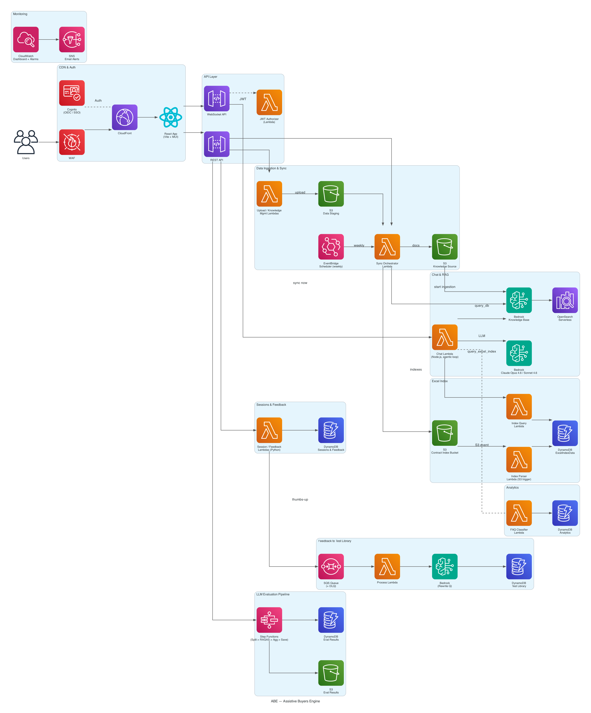

# ABE — Assistive Buyers Engine

## Overview

ABE is a serverless AI chatbot that helps users navigate procurement processes. Built for the Operational Services Division (OSD), ABE answers questions about acquisition regulations, finds contracts (GSA Schedule, BPAs, GWACs), identifies vendors, and explains compliance requirements — all grounded in a knowledge base of procurement documents.

**Live URL:** Deployed behind CloudFront with WAF protection. The URL is output by CloudFormation after deployment.

## Key Features

- **RAG-powered chat** — Claude Sonnet 4 with Bedrock Knowledge Base retrieval (semantic chunking, Titan Embed v2), prompt caching, and Bedrock Guardrails
- **Contract & Trade Index** — Structured Excel data (SWC Index, Trade Index) parsed into DynamoDB and queried via dedicated agent tools at runtime
- **LLM Evaluation Pipeline** — RAGAS-based evaluation via Step Functions with 4 metrics (faithfulness, relevancy, precision, recall), Test Library, and live progress tracking
- **Thumbs-up to Test Library** — Positive user feedback automatically generates curated Q&A test cases via LLM rewriting
- **Analytics Dashboard** — FAQ classification, traffic stats, agency breakdown, and user-level attribution
- **Admin Panel** — Document management, knowledge base sync, contract index upload, evaluation runs, feedback review, and test library CRUD
- **Operational Monitoring** — CloudWatch dashboard, 8 alarms, SNS email alerts

## Architecture



### Tech Stack

| Layer | Technology |
|-------|------------|
| **IaC** | AWS CDK (TypeScript) |
| **LLM** | Claude Sonnet 4 via Amazon Bedrock (cross-region inference) |
| **Knowledge Base** | Bedrock Knowledge Base + OpenSearch Serverless (semantic chunking) |
| **Backend** | Python 3.12 Lambdas + Node.js 20 ESM Lambdas (ARM64, X-Ray tracing) |
| **Eval Pipeline** | Step Functions + RAGAS 0.2.14 (Docker Lambda) |
| **Frontend** | React 18 + TypeScript + Vite + MUI + Amplify |
| **Auth** | Amazon Cognito (OIDC/SSO integration) |
| **APIs** | API Gateway (REST + WebSocket) |
| **Storage** | DynamoDB (8 tables) + S3 (6 buckets) |
| **CDN/Security** | CloudFront + WAF + OAC |
| **CI/CD** | GitHub Actions → CDK deploy on push to `main` |

### Project Structure

```
├── bin/gen-ai-mvp.ts                    # CDK app entry point
├── lib/
│   ├── constants.ts                     # Stack name, Cognito config
│   ├── gen-ai-mvp-stack.ts              # Root CDK stack
│   ├── chatbot-api/
│   │   ├── index.ts                     # API Gateway routes + construct wiring
│   │   ├── gateway/                     # REST + WebSocket API Gateway
│   │   ├── tables/tables.ts             # DynamoDB tables (8)
│   │   ├── buckets/buckets.ts           # S3 buckets (6)
│   │   ├── opensearch/                  # OpenSearch Serverless collection
│   │   ├── knowledge-base/              # Bedrock Knowledge Base + data source
│   │   └── functions/
│   │       ├── functions.ts             # All Lambda definitions (CDK)
│   │       ├── websocket-chat/          # Chat handler (Node.js ESM)
│   │       │   ├── index.mjs            # WebSocket handler + tool-use loop
│   │       │   ├── prompt.mjs           # System prompt
│   │       │   └── models/              # Bedrock model adapter
│   │       ├── session-handler/         # Chat session CRUD (Python)
│   │       ├── feedback-handler/        # User feedback CRUD (Python)
│   │       ├── metadata-handler/        # Doc metadata on S3 upload (Python)
│   │       ├── metrics-handler/         # Analytics aggregation (Python)
│   │       ├── faq-classifier/          # FAQ topic classification (Python)
│   │       ├── contract-index/          # SWC Contract Index (parser/query/api)
│   │       ├── trade-index/             # Trade Index (parser/query/api)
│   │       ├── knowledge-management/    # S3 CRUD + KB sync
│   │       ├── llm-eval/               # Eval results, test cases, test library
│   │       │   └── feedback-to-test-library/  # Thumbs-up → Q&A pipeline
│   │       └── step-functions/          # Eval state machine + Lambdas
│   └── user-interface/
│       ├── generate-app.ts              # CloudFront + WAF CDK
│       └── app/                         # React frontend (Vite)
│           └── src/
│               ├── components/chatbot/  # Chat UI
│               ├── pages/admin/         # Admin dashboard pages
│               ├── pages/help/          # Help & guide pages
│               └── common/api-client/   # API clients
├── .github/workflows/deploy.yml         # CI/CD pipeline
└── cdk.json                             # CDK config
```

## Getting Started

### Prerequisites

- [Node.js](https://nodejs.org/) v20+
- [AWS CLI](https://aws.amazon.com/cli/) v2 configured with credentials
- [AWS CDK](https://docs.aws.amazon.com/cdk/latest/guide/getting-started.html) v2
- [Python 3.12](https://www.python.org/) (for Lambda bundling)
- [Docker](https://www.docker.com/) (for RAGAS eval Lambda bundling)

### Installation

```bash
# Clone the repo
git clone <repo-url>
cd ai4impact-abe-chatbot-osd

# Install CDK/backend dependencies
npm install

# Install frontend dependencies
cd lib/user-interface/app && npm install && cd ../../..
```

### Configuration

1. Set the stack name and Cognito config in `lib/constants.ts`
2. Model IDs are configured via environment variables in `lib/chatbot-api/functions/functions.ts`:
   - `PRIMARY_MODEL_ID` — main chat + eval (default: Claude Sonnet 4)
   - `FAST_MODEL_ID` — titles, metadata, FAQ classification (default: Claude 3.5 Haiku)
3. Guardrail ID is set via `GUARDRAIL_ID` environment variable

### Deployment

**CI/CD (primary):** Push to `main` triggers automatic deployment via GitHub Actions.

**Manual deploy:**

```bash
# Set the AWS profile
export AWS_PROFILE=<your-aws-profile>

# Synth to check for errors
npx cdk synth ABEStackNonProd

# Preview changes
npx cdk diff ABEStackNonProd

# Deploy
npx cdk deploy ABEStackNonProd
```

### Useful Commands

| Command | Description |
|---------|-------------|
| `npx cdk synth ABEStackNonProd` | Synthesize CloudFormation template |
| `npx cdk diff ABEStackNonProd` | Preview infrastructure changes |
| `npx cdk deploy ABEStackNonProd` | Deploy the stack |
| `npm run build` | Compile TypeScript |
| `npm run watch` | Watch mode for TypeScript |

## Monitoring & Alerts

### CloudWatch Dashboard

A dashboard named **`ABEStackNonProd-Operations`** is created automatically on deploy:

| Row | Widgets | What it shows |
|-----|---------|---------------|
| 1 | Lambda Invocations, Lambda Errors | Call volume and error counts for all functions |
| 2 | Chat Lambda Duration, Lambda Throttles | Avg and p99 latency; throttle events |
| 3 | HTTP API Requests & Errors, HTTP API Latency | Request counts, 4xx/5xx rates, avg and p99 latency |
| 4 | WebSocket Connections, DynamoDB Throttles | Connect/message counts; throttled requests per table |
| 5 | Eval Pipeline Executions, Active Alarms | Step Functions started/succeeded/failed; alarm states |

Access via **CloudWatch → Dashboards** in the AWS Console, or:

```bash
aws cloudformation describe-stacks --stack-name ABEStackNonProd \
  --query "Stacks[0].Outputs[?OutputKey=='MonitoringDashboardURL'].OutputValue" \
  --output text --profile <your-aws-profile>
```

### Alarms

| Alarm | Trigger |
|-------|---------|
| Lambda errors | ≥1 error in 5 min on any function |
| Lambda throttles | Any function throttled |
| Chat Lambda high latency | Avg duration > 60s |
| API Gateway 5xx | Server-side errors |
| API Gateway 4xx | Elevated client errors |
| WebSocket zero connections | No connections for 15 min |
| DynamoDB throttles | Throttled requests on any table |
| Eval pipeline failures | Step Functions execution failed |

### Email Alerts

All alarms publish to an SNS topic. Subscribe via CDK:

```bash
npx cdk deploy ABEStackNonProd -c alarmEmail=you@example.com
```

Or manually: **SNS → Topics → `ABEStackNonProd Monitoring Alerts` → Create subscription** (Email protocol). Confirm via the email link.

In CI/CD, set the `ALARM_EMAIL` GitHub Actions secret.

## API Routes

### REST API

| Path | Methods | Purpose |
|------|---------|---------|
| `/user-session` | GET, POST, DELETE | Chat session management |
| `/user-feedback` | GET, POST, DELETE | User feedback CRUD |
| `/user-feedback/download-feedback` | POST | Feedback CSV export |
| `/s3-bucket-data` | POST | Knowledge base file listing |
| `/delete-s3-file` | POST | Knowledge base file deletion |
| `/signed-url` | POST | Pre-signed upload URLs |
| `/kb-sync/*` | GET | Knowledge base sync status/trigger |
| `/admin/contract-index/*` | GET, POST | Contract index status/preview/upload |
| `/admin/trade-index/*` | GET, POST | Trade index status/preview/upload |
| `/eval-results-handler` | POST | Evaluation results |
| `/eval-run-handler` | POST | Start evaluation run |
| `/metrics` | GET | Analytics data |
| `/test-library` | POST | Test library CRUD |
| `/test-library-from-feedback` | POST | Thumbs-up → test library |
| `/s3-test-cases-bucket-data` | POST | Test case file listing |
| `/signed-url-test-cases` | POST | Test case upload URLs |

### WebSocket API

| Route | Purpose |
|-------|---------|
| `$connect` / `$disconnect` | Connection lifecycle (JWT authorized) |
| `getChatbotResponse` | Streaming chat messages |

## Implementation Playbook

[Playbook (contains all required information)](https://drive.google.com/file/d/1VGy9SLVDIfwF0VHEA8sdsHzm85cuEeG_/view?usp=sharing)

## Contributing

1. Fork the repository
2. Create a feature branch (`git checkout -b feature/your-feature`)
3. Make changes and commit (`git commit -m 'Add feature'`)
4. Push to the branch (`git push origin feature/your-feature`)
5. Open a pull request
