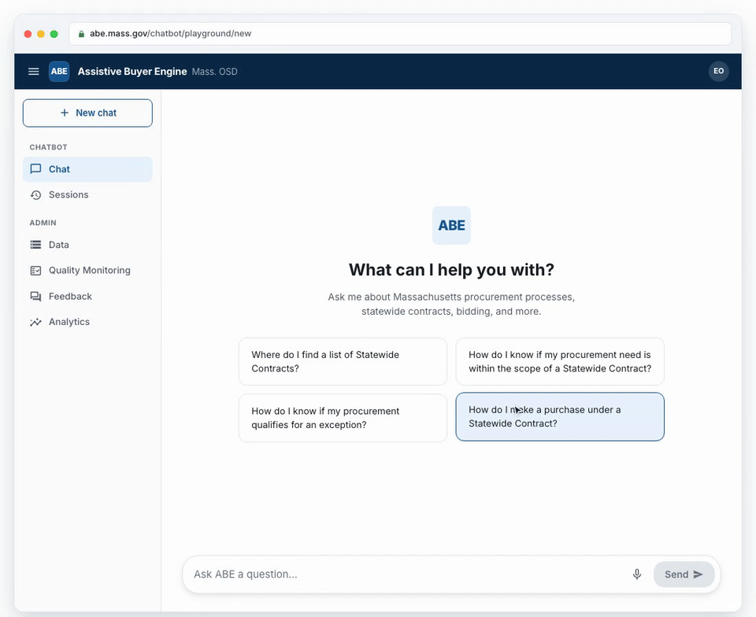
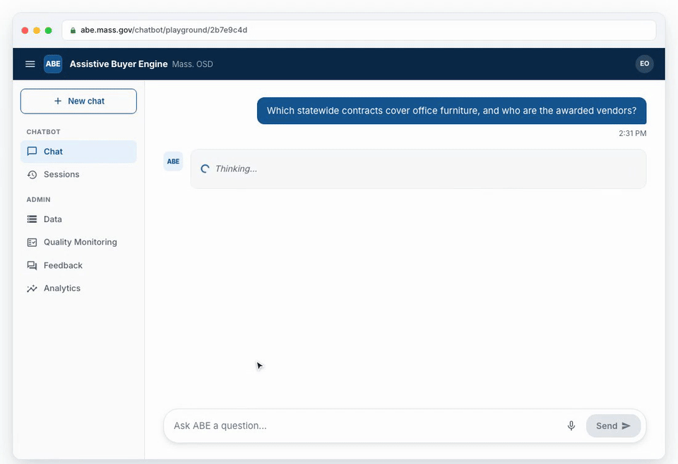
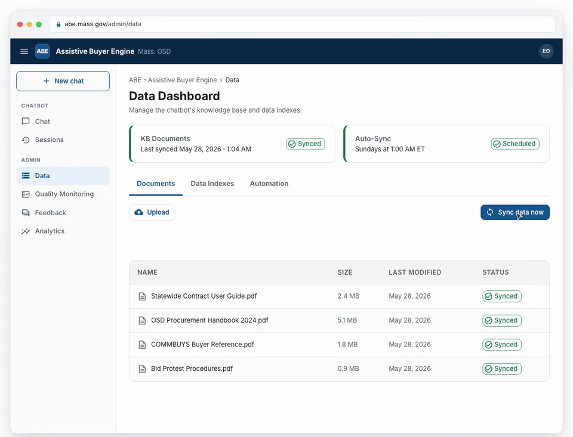
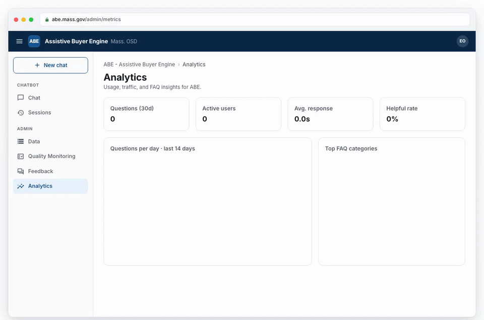
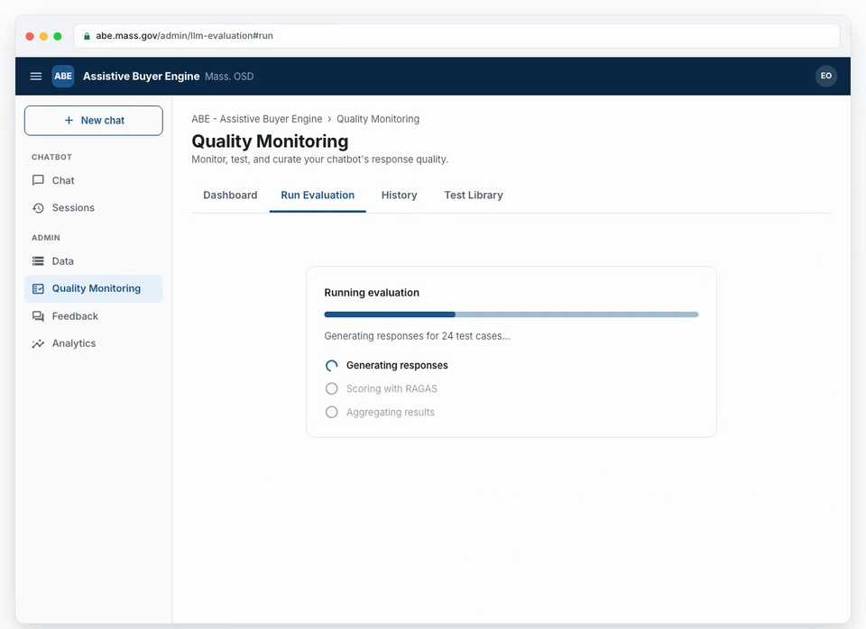

# ABE — Assistive Buyers Engine

## Overview

ABE is a serverless AI chatbot that helps users navigate procurement processes. Built for the Operational Services Division (OSD), ABE answers questions about acquisition regulations, finds contracts (GSA Schedule, BPAs, GWACs), identifies vendors, and explains compliance requirements — all grounded in a knowledge base of procurement documents.

**Live URL:** Deployed behind CloudFront with WAF protection. The URL is output by CloudFormation after deployment.

## Key Features

- **RAG-powered chat** — Claude Opus 4.6 with Bedrock Knowledge Base retrieval (semantic chunking, Titan Embed v2), prompt caching, and Bedrock Guardrails
- **Excel / Contract Index** — Structured Excel data parsed into DynamoDB and queried via a dedicated agent tool (`query_excel_index`) at runtime
- **LLM Evaluation Pipeline** — RAGAS-based evaluation via Step Functions with 7 metrics (similarity, relevance, correctness, context precision, context recall, response relevancy, faithfulness), Test Library, and live progress tracking
- **Thumbs-up to Test Library** — Positive user feedback automatically generates curated Q&A test cases via LLM rewriting
- **Analytics Dashboard** — FAQ classification, traffic stats, agency breakdown, and user-level attribution
- **Admin Panel** — Document management, knowledge base sync, Excel index upload, sync automation, evaluation runs, feedback review, and test library CRUD
- **Operational Monitoring** — CloudWatch dashboard, 43 alarms, SNS email alerts

## Demos

Short animated walkthroughs of ABE's main flows — faithful UI mockups recorded straight from the React frontend (see [Regenerating the demos](#regenerating-the-demos)).

### 💬 Chat — semantic RAG with citations

A procurement question kicks off the agentic tool-use loop: ABE searches the Bedrock Knowledge Base (`query_db`), streams the answer, and grounds it with inline `[N]` citations plus an expandable **Sources** panel.



### 📊 Structured contract lookup — Excel index

Vendor and contract questions route to the `query_excel_index` tool, which answers from the DynamoDB-backed Excel index as a clean table — distinct from semantic search over documents.



### 🗂️ Knowledge Base — documents & sync

Admins upload documents, trigger **Sync data now**, and watch Bedrock Knowledge Base ingestion progress until everything reads "Synced".



### 📈 Analytics dashboard

Usage, traffic, and FAQ-category insights — KPI cards and `@mui/x-charts` visualizations on the admin Analytics page.



### ✅ Quality monitoring — RAGAS evaluation

Run an evaluation and review the roll-up scores (Answer / Retrieval / Response quality) plus the per-question RAGAS metrics table.



### Regenerating the demos

The demos are self-contained React mockups (no backend, no auth) under [`lib/user-interface/app/src/demos/`](lib/user-interface/app/src/demos/), served at `/demo-animation/<id>` **in local dev only** (the route is gated behind `import.meta.env.DEV`, so it's tree-shaken out of production builds). Each demo is a single `useSteps()` timeline with an editable `TIMINGS` array. To re-record (needs `ffmpeg` + Playwright Chromium):

```bash
# one-time: npx playwright install chromium  &&  brew install ffmpeg
cd lib/user-interface/app && npm run dev      # 1. start the dev server (port 3000)
npm run record-demo                           # 2. from the repo root — records all demos
npm run record-demo -- chat excel             #    …or only specific ids
```

Raw captures (MP4 + GIF + WebM) land in `demo-recordings/` (git-ignored); copy the chosen GIFs into `docs/demos/`. MP4s for each flow also live in [`docs/demos/`](docs/demos/).

## Architecture


### Tech Stack

| Layer | Technology |
|-------|------------|
| **IaC** | AWS CDK (TypeScript) |
| **LLM** | Claude Opus 4.6 (primary) + Claude Sonnet 4.6 (fast) via Amazon Bedrock (cross-region inference) |
| **Knowledge Base** | Bedrock Knowledge Base + OpenSearch Serverless (semantic chunking) |
| **Backend** | Python 3.12 Lambdas + Node.js 20 ESM Lambdas (ARM64, X-Ray tracing) |
| **Eval Pipeline** | Step Functions + RAGAS 0.2.14 (Docker Lambda) |
| **Frontend** | React 18 + TypeScript + Vite + MUI + Amplify |
| **Auth** | Amazon Cognito (OIDC/SSO integration) |
| **APIs** | API Gateway (REST + WebSocket) |
| **Storage** | DynamoDB (13 tables) + S3 (8 buckets) |
| **CDN/Security** | CloudFront + WAF + OAC |
| **CI/CD** | GitHub Actions → CDK deploy on push to `main` |

### Project Structure

```
├── bin/gen-ai-mvp.ts                    # CDK app entry point + cdk-nag checks
├── lib/
│   ├── constants.ts                     # Stack name, Cognito config
│   ├── gen-ai-mvp-stack.ts              # Root CDK stack
│   ├── authorization/                   # Cognito user pool + WebSocket JWT authorizer
│   ├── chatbot-api/
│   │   ├── index.ts                     # API Gateway routes + construct wiring
│   │   ├── gateway/                     # REST + WebSocket API Gateway
│   │   ├── tables/tables.ts             # DynamoDB tables (13) + SQS queue/DLQ
│   │   ├── buckets/buckets.ts           # S3 buckets (8)
│   │   ├── opensearch/                  # OpenSearch Serverless collection
│   │   ├── knowledge-base/              # Bedrock Knowledge Base + data source
│   │   ├── monitoring/                  # CloudWatch dashboard + alarms + SNS
│   │   └── functions/
│   │       ├── functions.ts             # All Lambda definitions (CDK)
│   │       ├── websocket-chat/          # Chat handler (Node.js ESM)
│   │       │   ├── index.mjs            # WebSocket handler + agentic tool-use loop
│   │       │   ├── prompt.mjs           # System prompt
│   │       │   ├── tools.mjs            # Tool definitions + result capping
│   │       │   ├── kb.mjs               # Knowledge Base retrieval
│   │       │   ├── citations.mjs        # Citation management
│   │       │   ├── prompt-registry.mjs  # DynamoDB prompt registry
│   │       │   └── models/              # Bedrock model adapter
│   │       ├── session-handler/         # Chat session CRUD (Python)
│   │       ├── feedback-handler/        # User feedback CRUD + disposition (Python)
│   │       ├── context-summarizer/      # Conversation context compression (Python)
│   │       ├── metadata-handler/        # Doc metadata on S3 upload (Python)
│   │       ├── metadata-retrieval/      # Returns cached metadata.txt (Python)
│   │       ├── metrics-handler/         # Analytics aggregation (Python)
│   │       ├── faq-classifier/          # FAQ topic classification (Python)
│   │       ├── source-presign/          # Pre-signed S3 source URLs (Node.js)
│   │       ├── excel-index/             # Excel/Contract Index (parser/query/api)
│   │       ├── knowledge-management/    # S3 CRUD + KB sync
│   │       ├── sync-orchestrator/       # Staging → KB/index copy + ingestion (Python)
│   │       ├── sync-schedule/           # EventBridge sync schedule API (Python)
│   │       ├── llm-eval/                # Eval results, test cases, test library
│   │       │   └── feedback-to-test-library/  # Thumbs-up → Q&A pipeline
│   │       └── step-functions/          # Eval state machine + Lambdas
│   └── user-interface/
│       ├── index.ts                     # CloudFront site + BucketDeployment (builds React app)
│       ├── generate-app.ts              # CloudFront distribution + WAF Web ACL
│       └── app/                         # React frontend (Vite)
│           └── src/
│               ├── components/chatbot/  # Chat UI
│               ├── pages/admin/         # Admin dashboard pages
│               ├── pages/help/          # Help & guide pages
│               └── common/api-client/   # API clients
├── .github/workflows/deploy.yml         # CI/CD pipeline
└── cdk.json                             # CDK config
```

## Getting Started

### Prerequisites

- [Node.js](https://nodejs.org/) v20+
- [AWS CLI](https://aws.amazon.com/cli/) v2 configured with credentials
- [AWS CDK](https://docs.aws.amazon.com/cdk/latest/guide/getting-started.html) v2
- [Python 3.12](https://www.python.org/) (for Lambda bundling)
- [Docker](https://www.docker.com/) (for RAGAS eval Lambda bundling)

### Installation

```bash
# Clone the repo
git clone <repo-url>
cd ai4impact-abe-chatbot-osd

# Install CDK/backend dependencies
npm install

# Install frontend dependencies
cd lib/user-interface/app && npm install && cd ../../..
```

### Configuration

1. Set the stack name and Cognito config in `lib/constants.ts`
2. Model IDs are configured via environment variables in `lib/chatbot-api/functions/functions.ts`:
   - `PRIMARY_MODEL_ID` — main chat + eval (default: `us.anthropic.claude-opus-4-6-v1`)
   - `FAST_MODEL_ID` — metadata, FAQ classification, feedback analysis (default: `us.anthropic.claude-sonnet-4-6`)
3. Guardrail ID is set via `GUARDRAIL_ID` environment variable
4. _(Optional)_ Custom domain & HTTPS — serve the app from your own hostname with an ACM certificate: see [docs/custom-domain.md](docs/custom-domain.md)

### Deployment

**CI/CD (primary):** Push to `main` triggers automatic deployment via GitHub Actions.

**Manual deploy:**

```bash
# Set the AWS profile
export AWS_PROFILE=<your-aws-profile>

# Synth to check for errors
npx cdk synth ABEStackNonProd

# Preview changes
npx cdk diff ABEStackNonProd

# Deploy
npx cdk deploy ABEStackNonProd
```

### Useful Commands

| Command | Description |
|---------|-------------|
| `npx cdk synth ABEStackNonProd` | Synthesize CloudFormation template |
| `npx cdk diff ABEStackNonProd` | Preview infrastructure changes |
| `npx cdk deploy ABEStackNonProd` | Deploy the stack |
| `npm run build` | Compile TypeScript |
| `npm run watch` | Watch mode for TypeScript |

## Monitoring & Alerts

### CloudWatch Dashboard

A dashboard named **`ABEStackNonProd-Operations`** is created automatically on deploy:

| Row | Widgets | What it shows |
|-----|---------|---------------|
| 1 | Lambda Invocations, Lambda Errors | Call volume and error counts for all functions |
| 2 | Chat Lambda Duration, Lambda Throttles | Avg and p99 latency; throttle events |
| 3 | HTTP API Requests & Errors, HTTP API Latency | Request counts, 4xx/5xx rates, avg and p99 latency |
| 4 | WebSocket Connections, DynamoDB Throttles | Connect/message counts; throttled requests per table |
| 5 | Eval Pipeline Executions, Active Alarms | Step Functions started/succeeded/failed; alarm states |

Access via **CloudWatch → Dashboards** in the AWS Console, or:

```bash
aws cloudformation describe-stacks --stack-name ABEStackNonProd \
  --query "Stacks[0].Outputs[?OutputKey=='MonitoringDashboardURL'].OutputValue" \
  --output text --profile <your-aws-profile>
```

### Alarms

43 alarms publish to the SNS topic. Per-function and per-table alarms are created in a loop (10 monitored functions × 2 + 9 monitored tables × 2 + 5 standalone):

| Alarm | Scope | Trigger |
|-------|-------|---------|
| Lambda errors | Per function (×10) | ≥3 errors in 5 min (2 periods) |
| Lambda throttles | Per function (×10) | ≥1 throttle in 5 min (2 periods) |
| Chat Lambda high latency | Chat function | Avg duration ≥60s (3 periods) |
| DynamoDB read throttles | Per table (×9) | ≥5 read throttles in 5 min (2 periods) |
| DynamoDB write throttles | Per table (×9) | ≥5 write throttles in 5 min (2 periods) |
| API Gateway 5xx | HTTP API | ≥10 5xx in 5 min (2 periods) |
| API Gateway 4xx | HTTP API | ≥50 4xx in 5 min (3 periods) |
| WebSocket zero connections | WebSocket API | No connections for 15 min |
| Eval pipeline failures | Step Functions | ≥1 execution failure |

### Email Alerts

All alarms publish to an SNS topic. Subscribe via CDK:

```bash
npx cdk deploy ABEStackNonProd -c alarmEmail=you@example.com
```

Or manually: **SNS → Topics → `ABEStackNonProd Monitoring Alerts` → Create subscription** (Email protocol). Confirm via the email link.

In CI/CD, set the `ALARM_EMAIL` GitHub Actions secret.

## API Routes

All REST routes are served by an HTTP API Gateway and protected by a Cognito JWT authorizer (except CORS `OPTIONS` preflight).

| Path | Methods | Purpose |
|------|---------|---------|
| `/user-session` | GET, POST, DELETE | Chat session management |
| `/user-feedback` | GET, POST, DELETE | User feedback CRUD |
| `/user-feedback/download-feedback` | POST | Feedback CSV export |
| `/feedback` | POST | Submit feedback record |
| `/feedback/{feedbackId}/follow-up` | POST | Add follow-up to a feedback record |
| `/admin/feedback` | GET | List feedback records (admin) |
| `/admin/feedback/{feedbackId}` | GET, DELETE | Get/delete a feedback record |
| `/admin/feedback/{feedbackId}/analyze` | POST | LLM analysis of a feedback record |
| `/admin/feedback/{feedbackId}/disposition` | POST | Set feedback disposition |
| `/admin/feedback/{feedbackId}/promote-to-candidate` | POST | Promote feedback to monitoring case |
| `/admin/prompts` | GET, POST | List/create system prompt versions |
| `/admin/prompts/{versionId}` | GET, PUT, DELETE | Manage a prompt version |
| `/admin/prompts/{versionId}/publish` | POST | Publish (set LIVE) a prompt version |
| `/admin/prompts/{versionId}/ai-suggest` | POST | LLM-suggested prompt edit |
| `/admin/monitoring` | GET | Monitoring cases |
| `/admin/activity-log` | GET | Admin activity log |
| `/s3-bucket-data` | POST | Knowledge base file listing |
| `/delete-s3-file` | POST | Knowledge base file deletion |
| `/signed-url` | POST | Pre-signed KB upload URLs |
| `/kb-sync/still-syncing` | GET | KB ingestion in-progress check |
| `/kb-sync/sync-kb` | GET | Trigger KB ingestion job |
| `/kb-sync/get-last-sync` | GET | Last KB sync status |
| `/admin/indexes` | GET, POST | List/create Excel indexes |
| `/admin/indexes/{indexId}/status` | GET | Index parse status |
| `/admin/indexes/{indexId}/preview` | GET | Preview parsed index rows |
| `/admin/indexes/{indexId}/upload-url` | POST | Pre-signed index upload URL |
| `/admin/indexes/{indexId}` | PUT, DELETE | Update/delete an index |
| `/admin/sync-schedule` | GET, PUT | View/update the sync schedule |
| `/admin/sync-destinations` | GET | List sync destinations |
| `/admin/sync-history` | GET | Sync run history |
| `/admin/sync-now` | POST | Trigger an immediate sync |
| `/eval-results-handler` | POST | Evaluation results (read / stop run) |
| `/eval-run-handler` | POST | Start evaluation run |
| `/metrics` | GET | Analytics data |
| `/test-library` | POST | Test library CRUD |
| `/test-library-from-feedback` | POST | Thumbs-up → test library |
| `/s3-test-cases-bucket-data` | POST | Test case file listing |
| `/signed-url-test-cases` | POST | Test case upload URLs |
| `/source-presign` | POST | Pre-signed source document URLs |

### WebSocket API

| Route | Purpose |
|-------|---------|
| `$connect` | Connection open (JWT authorized via Lambda authorizer) |
| `$disconnect` | Connection close |
| `$default` | Fallback route |
| `getChatbotResponse` | Streaming chat messages |

## Implementation Playbook

[Playbook (contains all required information)](https://drive.google.com/file/d/1VGy9SLVDIfwF0VHEA8sdsHzm85cuEeG_/view?usp=sharing)

## Contributing

1. Fork the repository
2. Create a feature branch (`git checkout -b feature/your-feature`)
3. Make changes and commit (`git commit -m 'Add feature'`)
4. Push to the branch (`git push origin feature/your-feature`)
5. Open a pull request
