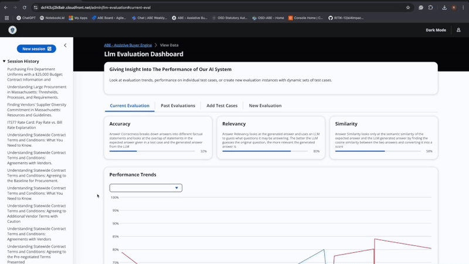

# 📌 ABE - Assistive Buyers Engine

> _A serverless AI-powered chatbot application designed to assist users in navigating procurement processes effectively._

---

## 🎬 Demo


> _Interactive AI-powered chatbot providing procurement assistance with real-time responses and guidance._

---

## 🧠 What It Does

### 👤 Procurement Official Features

- 🚀 **Procurement Assistance**: Intelligent chatbot interface  
    
  Provides clear, tailored guidance to procurement officials navigating procurement processes with a professional and approachable tone.

- 🔒 **Secure Authentication**: AWS Cognito integration  
  Complete user management with custom authorization logic and SSO support.

### 👑 Admin Features

- 📊 **Data Dashboard**: Knowledge base management and updates  
    
  Add new data sources, update existing content, and maintain the knowledge base to keep information current and comprehensive.

- 📝 **User Feedback Management**: Feedback collection and analysis  
    
  Collect, review, and analyze user feedback to improve system performance.

- 🧠 **LLM Evaluation**: AI model performance monitoring  
    
  Evaluate and fine-tune language model responses for optimal performance.

---

## 🧱 Architecture


- Serverless application built using AWS CDK (Cloud Development Kit)
- Integration with AWS services for scalable, secure operations
- Real-time chat capabilities with WebSocket support


---

## 🧰 Tech Stack

| Layer          | Tools & Frameworks                                      |
|----------------|---------------------------------------------------------|
| **Frontend**   | React, TypeScript, Vite, Cloudscape Design Components  |
| **Backend**    | AWS Lambda, API Gateway, WebSocket API                  |
| **AI/ML**      | AWS Bedrock, Knowledge Base, OpenSearch                 |
| **Infra/DevOps**| AWS CDK, AWS Cognito, DynamoDB, S3, CloudFormation    |
| **Auth**       | AWS Cognito with OIDC integration                        |

---

## 🧪 Setup

```bash
# Clone the repo
git clone https://github.com/The-Burnes-Center/ai4impact-abe-chatbot-osd.git
cd ai4impact-abe-chatbot-osd

# Install dependencies
npm i

# Build the project
npm run build

# Deploy to AWS
npx cdk deploy
```

### Prerequisites

- [Node.js](https://nodejs.org/) (version 14.x or later)
- [AWS CDK](https://docs.aws.amazon.com/cdk/latest/guide/work-with-cdk-nodejs.html)
- [Python](https://www.python.org/) (for Lambda functions)
- [AWS CLI](https://aws.amazon.com/cli/) configured with your AWS credentials

### Deployment Instructions:

1. Change the constants in `lib/constants.ts`
2. Deploy with `npm run build && npx cdk deploy [stack name from constants.ts]`
3. Configure Cognito using the CDK outputs

---

## 🧠 Core Modules

| Module              | Description                                                                 |
|---------------------|-----------------------------------------------------------------------------|
| `chatbot-api/`      | Core API logic with Lambda functions for chat functionality                 |
| `user-interface/`   | React-based frontend with real-time chat interface                         |
| `authorization/`    | AWS Cognito integration and custom authorization logic                      |
| `knowledge-base/`   | AI knowledge management and retrieval system                               |
| `functions/`        | Lambda functions for chat, metadata, sessions, and feedback                |
| `constants.ts`      | Configuration constants for deployment                                      |

---

## 🛡️ Security & Privacy

- AWS Cognito authentication with SSO support (Google, Facebook, Phone)
- Custom authorization logic for secure access control
- Serverless architecture with proper IAM roles and policies
- Real-time WebSocket connections with secure authentication

---

## 📖 Documentation

### Implementation Playbook
[Complete Implementation Guide](https://drive.google.com/file/d/1VGy9SLVDIfwF0VHEA8sdsHzm85cuEeG_/view?usp=sharing) - Contains all required information for setup, deployment, and configuration.

---

## 📦 Roadmap

- [ ] Enhanced knowledge base capabilities
- [ ] Multi-language support
- [ ] Advanced procurement workflow automation
- [ ] Integration with external procurement systems

---

## 🤝 Contributing

Contributions are welcome! Please follow these steps:

1. Fork the repository
2. Create a new branch (`git checkout -b feature/YourFeature`)
3. Make your changes and commit them (`git commit -m 'Add some feature'`)
4. Push to the branch (`git push origin feature/YourFeature`)
5. Open a pull request

---

## 📄 License

MIT License – see `LICENSE.md` for details.

---

## 👥 Authors & Acknowledgements

- Built by [Prasoon Raj](https://www.linkedin.com/in/prasoon-raj-902/), Rui Ge, Ritik Bompilwar and Divya Hegde
- Developed for AI4Impact initiative
- Powered by AWS serverless technologies

---

### Useful Commands

* `npm run build` - compile typescript to js
* `npm run watch` - watch for changes and compile
* `npm run test` - perform the jest unit tests
* `npx cdk deploy` - deploy this stack to your default AWS account/region
* `npx cdk diff` - compare deployed stack with current state
* `npx cdk synth` - emits the synthesized CloudFormation template
